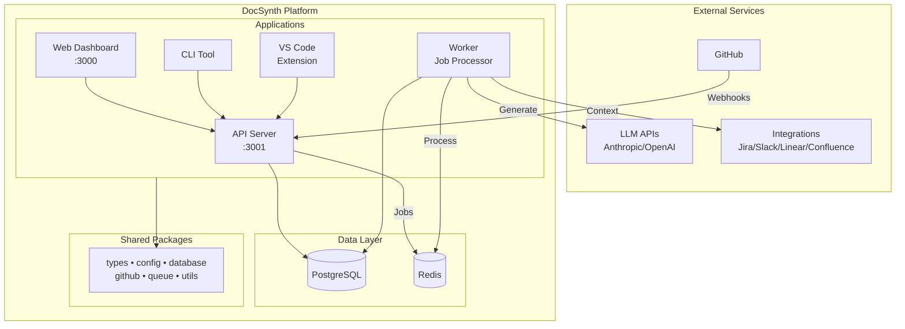

# DocSynth

[](https://github.com/docsynth/docsynth/actions/workflows/ci.yml)
[](LICENSE)
[](https://nodejs.org)

> AI-powered documentation that stays current with your code

DocSynth automatically generates and maintains documentation by observing code changes, understanding context from PRs and tickets, and producing human-quality technical writing.

**How it works:** When you merge a PR, DocSynth analyzes the code changes, gathers context from your PR description and linked issues, generates updated documentation using LLMs, and opens a new PR with the doc changes for your review.

```
PR Merged → Change Analysis → Intent Inference → Doc Generation → Doc Review → PR Created
```

## Key Features

- 🤖 **AI-Powered Generation** — Uses LLMs (Anthropic Claude, OpenAI GPT) to generate documentation from code changes
- 🔄 **Always Current** — Documentation updates automatically when code changes via GitHub webhooks
- 🔗 **Multi-Source Context** — Gathers context from PRs, Jira, Slack, Linear, Confluence, and Notion
- ✍️ **Human Quality** — Produces documentation that reads naturally with customizable tone and style matching
- 📊 **Health Dashboard** — Track documentation freshness, coverage, and drift
- 💬 **Chat Interface** — RAG-powered Q&A about your codebase

## Quick Start

### Prerequisites

- Node.js 20+
- Docker (for local development)
- GitHub account

### One-Command Setup

```bash
git clone https://github.com/docsynth/docsynth.git
cd docsynth
make quickstart    # Checks deps, installs, starts Docker, sets up DB, launches dev servers
```

Or equivalently: `npm run quickstart`

This single command will:

- Verify prerequisites (Node.js 20+, Docker running)
- Install npm dependencies and generate Prisma client
- Create `.env` with auto-generated secrets and **DEMO_MODE enabled**
- Start PostgreSQL and Redis via Docker
- Apply the database schema and seed sample data
- Start all development servers

Open http://localhost:3000 (dashboard) and http://localhost:3001/docs (API docs).

> **Note:** Demo mode lets you explore DocSynth without a GitHub App. To connect a real repository, edit `.env`, set `DEMO_MODE=false`, and configure your [GitHub App credentials](#environment-variables).

### Manual Setup

```bash
npm install
cp .env.example .env   # Edit to add your config
docker compose up -d    # Start PostgreSQL and Redis
npm run db:generate     # Generate Prisma client
npm run db:push         # Apply database schema
npm run dev             # Start development servers
```

### Full-Stack Docker (No Node.js Required)

```bash
./scripts/setup.sh     # Creates .env with secrets, starts Docker, sets up DB
docker compose -f docker-compose.dev.yml up
```

### Using the CLI

```bash
# Initialize DocSynth in a repository
docsynth init

# Generate documentation locally
docsynth generate

# Check status
docsynth status

# Login to DocSynth cloud
docsynth login
```

## Documentation

Full documentation is available at [docsynth.dev](https://docsynth.dev) or locally:

```bash
npm run docs    # Start docs site at http://localhost:3000
```

Covers getting started, core concepts, API reference, guides, and advanced topics.

## Architecture

DocSynth is built as a monorepo with the following structure:

```
docsynth/
├── apps/
│   ├── api/              # REST API server (Hono)
│   ├── worker/           # Background job processor (BullMQ)
│   ├── web/              # Dashboard (Next.js 16)
│   ├── cli/              # CLI tool (Commander.js)
│   ├── mcp-server/       # MCP server for AI agents
│   └── vscode-extension/ # VS Code extension
├── packages/
│   ├── types/            # Shared TypeScript types
│   ├── config/           # Configuration & feature flags
│   ├── database/         # Prisma client & schema
│   ├── github/           # GitHub API client (Octokit)
│   ├── queue/            # Job queue (BullMQ + Redis)
│   └── utils/            # Shared utilities (logging, errors, retries)
├── examples/             # Runnable examples & config templates
└── docker-compose.yml
```

### High-Level Architecture



### Processing Pipeline

1. **Change Analysis** — Parses diffs, identifies semantic changes (functions, classes, APIs)
2. **Intent Inference** — Gathers context from PRs, Jira, Slack to understand "why"
3. **Doc Generation** — Uses LLMs to generate documentation matching your style
4. **Doc Review** — AI-based quality review and validation
5. **PR Creation** — Creates a pull request with generated docs for human review

## Configuration

Create a `.docsynth.json` in your repository:

```json
{
  "version": 1,
  "triggers": {
    "onPRMerge": true,
    "branches": ["main"]
  },
  "filters": {
    "includePaths": ["src/**/*", "lib/**/*"],
    "excludePaths": ["**/*.test.*", "**/*.spec.*", "**/node_modules/**"]
  },
  "docTypes": {
    "readme": true,
    "apiDocs": true,
    "changelog": true
  },
  "style": {
    "tone": "technical",
    "includeExamples": true
  }
}
```

See `examples/config-templates/` for pre-built configs for Node.js/TypeScript, Python/FastAPI, and Go projects.

### Configuration Options

| Option                  | Description                                      |
| ----------------------- | ------------------------------------------------ |
| `triggers.onPRMerge`    | Generate docs when PRs are merged                |
| `triggers.branches`     | Branches to watch for changes                    |
| `filters.includePaths`  | Glob patterns for files to include               |
| `filters.excludePaths`  | Glob patterns for files to exclude               |
| `docTypes.readme`       | Generate/update README files                     |
| `docTypes.apiDocs`      | Generate API reference documentation             |
| `docTypes.changelog`    | Maintain changelog entries                       |
| `style.tone`            | Writing tone: `technical`, `casual`, or `formal` |
| `style.includeExamples` | Include code examples in generated docs          |

## Development

> **Tip:** Run `make` to see all available commands with descriptions.

```bash
# Run all apps in development mode
npm run dev

# Run a single service (less log noise)
npm run dev:api       # API server only
npm run dev:web       # Web dashboard only
npm run dev:worker    # Worker only

# Run unit tests (no Docker required)
npm run test:unit

# Run all tests (requires Docker services)
npm run test

# Watch mode for tests during development
npm run test:watch

# Lint code
npm run lint

# Type check
npm run typecheck

# Build all packages
npm run build

# Check environment health
npm run doctor

# Seed sample data
npm run db:seed
```

### Environment Variables

See `.env.example` for all environment variables. Required variables are clearly marked.

**Required Variables:**

| Variable         | Description                           |
| ---------------- | ------------------------------------- |
| `DATABASE_URL`   | PostgreSQL connection string          |
| `REDIS_URL`      | Redis connection string               |
| `SESSION_SECRET` | Session encryption key (min 32 chars) |
| `JWT_SECRET`     | JWT signing key (min 32 chars)        |

**GitHub App (required unless `DEMO_MODE=true`):**

| Variable                 | Description                         |
| ------------------------ | ----------------------------------- |
| `GITHUB_APP_ID`          | GitHub App ID                       |
| `GITHUB_APP_PRIVATE_KEY` | GitHub App private key (PEM format) |
| `GITHUB_CLIENT_ID`       | GitHub OAuth client ID              |
| `GITHUB_CLIENT_SECRET`   | GitHub OAuth client secret          |
| `GITHUB_WEBHOOK_SECRET`  | Secret for validating webhooks      |

**Optional Integrations:**

| Variable                                      | Description                          |
| --------------------------------------------- | ------------------------------------ |
| `COPILOT_API_KEY`                             | GitHub Copilot SDK API key           |
| `JIRA_BASE_URL`, `JIRA_API_TOKEN`             | Jira integration for context         |
| `SLACK_BOT_TOKEN`                             | Slack integration for notifications  |
| `LINEAR_API_KEY`                              | Linear integration for issue context |
| `CONFLUENCE_BASE_URL`, `CONFLUENCE_API_TOKEN` | Confluence publishing                |
| `NOTION_API_TOKEN`                            | Notion publishing                    |
| `STRIPE_SECRET_KEY`                           | Stripe for billing                   |

## Examples

| Example                                                           | Description                              | Run                                      |
| ----------------------------------------------------------------- | ---------------------------------------- | ---------------------------------------- |
| [API Usage](examples/api-usage.ts)                                | Interact with the REST API               | `npx tsx examples/api-usage.ts`          |
| [MCP Client](examples/mcp-client.ts)                              | Connect AI agents to DocSynth            | `npx tsx examples/mcp-client.ts`         |
| [SCM Providers](examples/scm-provider-usage.ts)                   | Multi-SCM provider integration           | `npx tsx examples/scm-provider-usage.ts` |
| [Config: Node.js](examples/config-templates/node-typescript.json) | `.docsynth.json` for TypeScript projects | Copy to your repo                        |
| [Config: Python](examples/config-templates/python-fastapi.json)   | `.docsynth.json` for FastAPI projects    | Copy to your repo                        |
| [Config: Go](examples/config-templates/go-module.json)            | `.docsynth.json` for Go modules          | Copy to your repo                        |

## VS Code Extension

Install the DocSynth VS Code extension for IDE integration:

**Features:**

- Real-time documentation preview as you code
- Documentation health dashboard
- Inline hints for undocumented code
- One-click documentation generation
- GitHub Copilot Chat integration

**Commands:**

- `DocSynth: Generate Docs` - Generate docs for current file
- `DocSynth: Preview Docs` - Preview documentation (`Cmd+Shift+P`)
- `DocSynth: Add Inline Doc` - Document selected code (`Cmd+Shift+D`)
- `DocSynth: Check Health` - View documentation health status

## Troubleshooting

### Common Issues

**`Can't reach database server at localhost:5432`**
PostgreSQL is not running. Start it with:

```bash
docker compose up -d postgres
```

**`connect ECONNREFUSED 127.0.0.1:6379`**
Redis is not running. Start it with:

```bash
docker compose up -d redis
```

**`Invalid environment configuration` / Zod validation error**
Your `.env` file is missing required variables or has invalid values.

- Run `npm run doctor` to diagnose
- `SESSION_SECRET` and `JWT_SECRET` must be at least 32 characters
- Generate secrets with: `openssl rand -hex 32`

**`Cannot find module '.prisma/client'`**
Prisma client not generated. Run:

```bash
npm run db:generate
```

**`EADDRINUSE: port 3000 (or 3001) already in use`**
Another process is using the port. Find and stop it:

```bash
lsof -i :3000    # Find the process
kill <PID>       # Stop it
```

**ESM import errors or `ERR_REQUIRE_ESM`**
You're running Node.js < 20. Check with `node -v` and upgrade to 20+.

**`GitHub App initialization failed`**
GitHub App credentials are missing or invalid. Either:

- Configure your GitHub App credentials in `.env` (see [setup guide](https://docsynth.dev/docs/getting-started/github-app-setup))
- Or set `DEMO_MODE=true` in `.env` to skip GitHub App setup

**Docker containers won't start**
Ensure Docker Desktop is running, then:

```bash
docker compose down        # Stop existing containers
docker compose up -d       # Start fresh
docker compose logs        # Check for errors
```

### Diagnostic Commands

```bash
npm run doctor             # Check environment health
docker compose ps          # Check container status
docker compose logs        # View container logs
npx prisma studio          # Browse database (in packages/database/)
```

## License

MIT

## Contributing

Contributions are welcome! Please read our [Contributing Guide](CONTRIBUTING.md) before submitting a PR.

---

## API Reference

### Apps

| App                | Port | Description                                |
| ------------------ | ---- | ------------------------------------------ |
| `api`              | 3001 | REST API server with 40+ endpoints         |
| `web`              | 3000 | Next.js dashboard with real-time updates   |
| `worker`           | -    | Background job processor (17 worker types) |
| `cli`              | -    | Command-line interface                     |
| `mcp-server`       | -    | MCP server for AI agent integration        |
| `vscode-extension` | -    | VS Code integration                        |

### Packages

| Package              | Purpose                                        |
| -------------------- | ---------------------------------------------- |
| `@docsynth/types`    | Shared TypeScript types and domain models      |
| `@docsynth/config`   | Environment config, feature flags, tier limits |
| `@docsynth/database` | Prisma ORM with repository pattern             |
| `@docsynth/github`   | GitHub App/OAuth client (Octokit wrapper)      |
| `@docsynth/queue`    | BullMQ job queue with 26+ job types            |
| `@docsynth/utils`    | Logging, errors, retries, caching, LLM clients |

### Job Types

The worker processes the following job types:

| Category     | Jobs                                                                        |
| ------------ | --------------------------------------------------------------------------- |
| **Core**     | `CHANGE_ANALYSIS`, `DOC_GENERATION`, `DOC_REVIEW`, `INTENT_INFERENCE`       |
| **Features** | `DIAGRAM_GENERATION`, `TRANSLATION`, `ADR_GENERATION`, `EXAMPLE_VALIDATION` |
| **Scanning** | `DRIFT_SCAN`, `HEALTH_SCAN`, `COVERAGE_SCAN`, `COMPLIANCE_SCAN`             |
| **AI**       | `CHAT_RAG`, `VECTOR_INDEX`, `KNOWLEDGE_GRAPH`                               |
