# DocSynth

> AI-powered documentation that stays current with your code

DocSynth automatically generates and maintains documentation by observing code changes, understanding context from PRs and tickets, and producing human-quality technical writing.

## Features

- 🤖 **AI-Powered Generation** - Uses advanced LLMs (Anthropic Claude, OpenAI GPT) to generate documentation from code changes
- 🔄 **Always Current** - Documentation updates automatically when code changes via GitHub webhooks
- 🔗 **Multi-Source Context** - Gathers context from PRs, Jira, Slack, Linear, Confluence, and Notion
- ✍️ **Human Quality** - Produces documentation that reads naturally with customizable tone
- 🎨 **Style Learning** - Matches your team's existing documentation style
- 📊 **Health Dashboard** - Track documentation freshness and coverage
- 🌐 **Multi-Language** - Translate documentation to multiple languages
- 📈 **Architecture Diagrams** - Auto-generate Mermaid diagrams from code
- 🧠 **Knowledge Graph** - Build semantic relationships between docs
- 💬 **Chat Interface** - RAG-powered Q&A about your codebase

## Quick Start

### Prerequisites

- Node.js 20+
- Docker (for local development)
- GitHub account

### Installation

```bash
# Clone the repository
git clone https://github.com/docsynth/docsynth.git
cd docsynth

# Install dependencies
npm install

# Set up environment
cp .env.example .env
# Edit .env with your configuration

# Start development services
docker-compose up -d

# Generate Prisma client
npm run db:generate

# Run database migrations
npm run db:push

# Start development servers
npm run dev
```

### Using the CLI

```bash
# Initialize DocSynth in a repository
docsynth init

# Generate documentation locally
docsynth generate

# Check status
docsynth status

# Login to DocSynth cloud
docsynth login
```

## Architecture

DocSynth is built as a monorepo with the following structure:

```
docsynth/
├── apps/
│   ├── api/              # REST API server (Hono)
│   ├── worker/           # Background job processor (BullMQ)
│   ├── web/              # Dashboard (Next.js 16)
│   ├── cli/              # CLI tool (Commander.js)
│   └── vscode-extension/ # VS Code extension
├── packages/
│   ├── types/            # Shared TypeScript types
│   ├── config/           # Configuration & feature flags
│   ├── database/         # Prisma client & schema
│   ├── github/           # GitHub API client (Octokit)
│   ├── queue/            # Job queue (BullMQ + Redis)
│   └── utils/            # Shared utilities (logging, errors, retries)
└── docker-compose.yml
```

### High-Level Architecture

```mermaid
flowchart TB
    subgraph External["External Services"]
        GH[GitHub]
        LLM[LLM APIs<br/>Anthropic/OpenAI]
        INT[Integrations<br/>Jira/Slack/Linear/Confluence]
    end

    subgraph DocSynth["DocSynth Platform"]
        subgraph Apps["Applications"]
            API[API Server<br/>:3001]
            WEB[Web Dashboard<br/>:3000]
            WORKER[Worker<br/>Job Processor]
            CLI[CLI Tool]
            VSC[VS Code<br/>Extension]
        end

        subgraph Data["Data Layer"]
            PG[(PostgreSQL)]
            REDIS[(Redis)]
        end

        subgraph Packages["Shared Packages"]
            PKG[types • config • database<br/>github • queue • utils]
        end
    end

    GH -->|Webhooks| API
    API -->|Jobs| REDIS
    WORKER -->|Process| REDIS
    WORKER -->|Generate| LLM
    WORKER -->|Context| INT
    API --> PG
    WORKER --> PG
    WEB --> API
    CLI --> API
    VSC --> API
    Apps --> PKG
```



### Processing Pipeline


**Pipeline Stages:**

1. **Change Analysis** - Parses diffs, identifies semantic changes (functions, classes, APIs)
2. **Intent Inference** - Gathers context from PRs, Jira, Slack to understand "why"
3. **Doc Generation** - Uses LLMs to generate documentation matching your style
4. **Doc Review** - AI-based quality review and validation
5. **PR Creation** - Creates a pull request with generated docs for human review

## Configuration

Create a `.docsynth.json` in your repository:

```json
{
  "version": 1,
  "triggers": {
    "onPRMerge": true,
    "branches": ["main"]
  },
  "filters": {
    "includePaths": ["src/**/*", "lib/**/*"],
    "excludePaths": ["**/*.test.*", "**/*.spec.*", "**/node_modules/**"]
  },
  "docTypes": {
    "readme": true,
    "apiDocs": true,
    "changelog": true
  },
  "style": {
    "tone": "technical",
    "includeExamples": true
  }
}
```

### Configuration Options

| Option | Description |
|--------|-------------|
| `triggers.onPRMerge` | Generate docs when PRs are merged |
| `triggers.branches` | Branches to watch for changes |
| `filters.includePaths` | Glob patterns for files to include |
| `filters.excludePaths` | Glob patterns for files to exclude |
| `docTypes.readme` | Generate/update README files |
| `docTypes.apiDocs` | Generate API reference documentation |
| `docTypes.changelog` | Maintain changelog entries |
| `style.tone` | Writing tone: `technical`, `casual`, or `formal` |
| `style.includeExamples` | Include code examples in generated docs |

## Development

```bash
# Run all apps in development mode
npm run dev

# Run tests
npm run test

# Lint code
npm run lint

# Type check
npm run typecheck

# Build all packages
npm run build
```

### Environment Variables

See `.env.example` for all required environment variables.

**Required Variables:**

| Variable | Description |
|----------|-------------|
| `DATABASE_URL` | PostgreSQL connection string |
| `REDIS_URL` | Redis connection string |
| `GITHUB_APP_ID` | GitHub App ID |
| `GITHUB_APP_PRIVATE_KEY` | GitHub App private key (PEM format) |
| `GITHUB_CLIENT_ID` | GitHub OAuth client ID |
| `GITHUB_CLIENT_SECRET` | GitHub OAuth client secret |
| `GITHUB_WEBHOOK_SECRET` | Secret for validating webhooks |
| `JWT_SECRET` | Secret for JWT token signing |
| `SESSION_SECRET` | Secret for session encryption |

**LLM Configuration (at least one required):**

| Variable | Description |
|----------|-------------|
| `ANTHROPIC_API_KEY` | Anthropic Claude API key |
| `OPENAI_API_KEY` | OpenAI API key |
| `COPILOT_API_KEY` | GitHub Copilot SDK API key |

**Optional Integrations:**

| Variable | Description |
|----------|-------------|
| `JIRA_BASE_URL`, `JIRA_API_TOKEN` | Jira integration for context |
| `SLACK_BOT_TOKEN` | Slack integration for notifications |
| `LINEAR_API_KEY` | Linear integration for issue context |
| `CONFLUENCE_BASE_URL`, `CONFLUENCE_API_TOKEN` | Confluence publishing |
| `NOTION_API_TOKEN` | Notion publishing |
| `STRIPE_SECRET_KEY` | Stripe for billing (optional) |

## VS Code Extension

Install the DocSynth VS Code extension for IDE integration:

**Features:**
- Real-time documentation preview as you code
- Documentation health dashboard
- Inline hints for undocumented code
- One-click documentation generation
- GitHub Copilot Chat integration

**Commands:**
- `DocSynth: Generate Docs` - Generate docs for current file
- `DocSynth: Preview Docs` - Preview documentation (`Cmd+Shift+P`)
- `DocSynth: Add Inline Doc` - Document selected code (`Cmd+Shift+D`)
- `DocSynth: Check Health` - View documentation health status

## License

MIT

## Contributing

Contributions are welcome! Please read our contributing guidelines before submitting a PR.

---

## API Reference

### Apps

| App | Port | Description |
|-----|------|-------------|
| `api` | 3001 | REST API server with 40+ endpoints |
| `web` | 3000 | Next.js dashboard with real-time updates |
| `worker` | - | Background job processor (17 worker types) |
| `cli` | - | Command-line interface |
| `vscode-extension` | - | VS Code integration |

### Packages

| Package | Purpose |
|---------|---------|
| `@docsynth/types` | Shared TypeScript types and domain models |
| `@docsynth/config` | Environment config, feature flags, tier limits |
| `@docsynth/database` | Prisma ORM with repository pattern |
| `@docsynth/github` | GitHub App/OAuth client (Octokit wrapper) |
| `@docsynth/queue` | BullMQ job queue with 26+ job types |
| `@docsynth/utils` | Logging, errors, retries, caching, LLM clients |

### Job Types

The worker processes the following job types:

| Category | Jobs |
|----------|------|
| **Core** | `CHANGE_ANALYSIS`, `DOC_GENERATION`, `DOC_REVIEW`, `INTENT_INFERENCE` |
| **Features** | `DIAGRAM_GENERATION`, `TRANSLATION`, `ADR_GENERATION`, `EXAMPLE_VALIDATION` |
| **Scanning** | `DRIFT_SCAN`, `HEALTH_SCAN`, `COVERAGE_SCAN`, `COMPLIANCE_SCAN` |
| **AI** | `CHAT_RAG`, `VECTOR_INDEX`, `KNOWLEDGE_GRAPH` |
