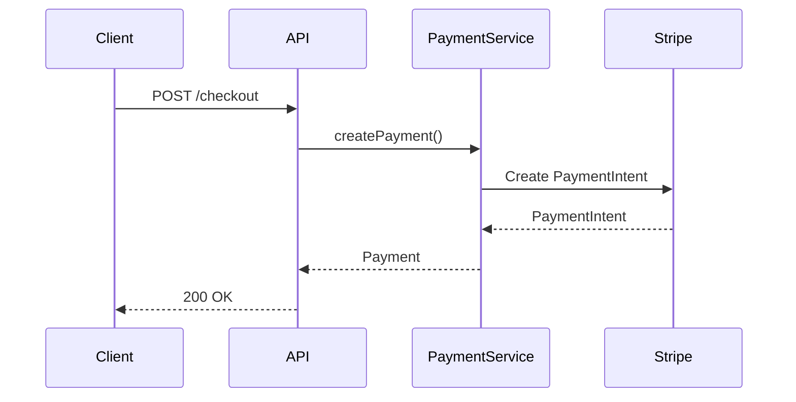

# Product Requirements Document: DocSynth

## Living Documentation Generator

**Document Version:** 1.0  
**Last Updated:** January 28, 2026  
**Author:** Jose David Baena  
**Status:** Draft

---

## Table of Contents

1. [Executive Summary](#1-executive-summary)
2. [Problem Statement](#2-problem-statement)
3. [Market Analysis](#3-market-analysis)
4. [Target Users & Personas](#4-target-users--personas)
5. [Product Vision & Strategy](#5-product-vision--strategy)
6. [Features & Requirements](#6-features--requirements)
7. [Technical Architecture](#7-technical-architecture)
8. [User Stories & Use Cases](#8-user-stories--use-cases)
9. [User Experience & Design](#9-user-experience--design)
10. [Success Metrics & KPIs](#10-success-metrics--kpis)
11. [Competitive Analysis](#11-competitive-analysis)
12. [Go-to-Market Strategy](#12-go-to-market-strategy)
13. [Monetization Strategy](#13-monetization-strategy)
14. [Risks & Mitigations](#14-risks--mitigations)
15. [Roadmap & Milestones](#15-roadmap--milestones)
16. [Dependencies & Constraints](#16-dependencies--constraints)
17. [Appendices](#17-appendices)

---

## 1. Executive Summary

### 1.1 Product Overview

DocSynth is an AI-powered documentation generator that maintains always-current documentation by observing code changes, inferring intent from multiple sources, and generating human-quality technical writing. Built on the GitHub Copilot SDK, DocSynth transforms documentation from a manual chore into an automated byproduct of development.

### 1.2 Value Proposition

**For development teams struggling to keep documentation current**, DocSynth automatically generates and updates documentation by understanding code changes, PR discussions, and ticket context—ensuring documentation is always accurate, comprehensive, and written in natural human language.

### 1.3 Key Differentiators

- **Multi-Source Intelligence:** Synthesizes code, PRs, tickets, and Slack to understand "why" not just "what"
- **Human-Quality Writing:** Produces documentation that reads like it was written by a senior engineer
- **Automatic Updates:** Documentation stays current as code evolves—no manual maintenance
- **MCP-Native:** Integrates with Jira, Slack, Confluence via Model Context Protocol
- **Style Consistency:** Learns and maintains your team's documentation voice

### 1.4 Business Opportunity

- **Target Market Size:** $2-5B documentation tools market by 2030
- **Revenue Model:** Per-repo SaaS pricing ($10-30/month) with team tiers
- **Primary Customers:** Development teams tired of outdated documentation

---

## 2. Problem Statement

### 2.1 The Documentation Paradox

Everyone agrees documentation is important. No one wants to write it:

**The Numbers:**

- **91% of developers** say good documentation is important
- **54% of documentation** is outdated within 3 months of writing
- **Only 23%** of developer time "should" be spent on docs is actually spent
- **Average time to find information** in poor docs: 30+ minutes
- **New hire onboarding** takes 2x longer with poor documentation

### 2.2 Why Documentation Fails

```
┌─────────────────────────────────────────────────────────────────┐
│                Why Documentation Is Always Outdated              │
├─────────────────────────────────────────────────────────────────┤
│                                                                  │
│  The Documentation Death Spiral:                                │
│  ──────────────────────────────                                 │
│                                                                  │
│  1. Engineer writes feature                                     │
│  2. Documentation task added to backlog                         │
│  3. Feature ships without docs (deadline pressure)              │
│  4. Docs written weeks later (context lost)                     │
│  5. Feature changes, docs not updated                           │
│  6. Docs become misleading/wrong                                │
│  7. Team stops trusting docs                                    │
│  8. Team stops writing docs                                     │
│  9. Knowledge lives only in people's heads                      │
│  10. Key person leaves, knowledge lost                          │
│                                                                  │
│  Result: Expensive onboarding, repeated questions,              │
│          tribal knowledge, bus factor risk                      │
│                                                                  │
└─────────────────────────────────────────────────────────────────┘
```

### 2.3 The Root Cause

Documentation is separate from development:

| Activity | Development   | Documentation              |
| -------- | ------------- | -------------------------- |
| When     | During coding | After coding (maybe)       |
| Who      | Developer     | Developer (or tech writer) |
| Tools    | IDE, GitHub   | Confluence, README         |
| Review   | PR review     | Rarely reviewed            |
| Testing  | CI/CD         | No validation              |

**The Solution:** Make documentation a byproduct of development, not a separate task.

### 2.4 Current Solutions Fall Short

| Solution              | Limitation                              |
| --------------------- | --------------------------------------- |
| **JSDoc/Docstrings**  | Function-level only, manual maintenance |
| **ReadMe.io/GitBook** | Hosting only, doesn't generate content  |
| **Mintlify**          | API docs only, limited to OpenAPI       |
| **AI Assistants**     | On-demand generation, not continuous    |
| **Tech Writers**      | Expensive, don't scale, still lag code  |

### 2.5 The Opportunity

DocSynth solves the problem by:

1. **Observing** code changes as they happen
2. **Understanding** intent from PRs, tickets, discussions
3. **Generating** human-quality documentation automatically
4. **Updating** docs when code changes
5. **Maintaining** style consistency across the codebase

---

## 3. Market Analysis

### 3.1 Market Size & Growth

**Total Addressable Market (TAM):**

- Developer documentation tools: $5B+ by 2030
- Technical writing services: $3B+ annually

**Serviceable Addressable Market (SAM):**

- Automated documentation tools: $2-5B by 2030
- Includes: doc generators, knowledge bases, API docs

**Serviceable Obtainable Market (SOM):**

- AI-powered documentation: $300-500M by 2028
- Based on: 50M+ active repos, 2% adoption, $300/year average

### 3.2 Market Trends

**Favorable Trends:**

1. **Developer Experience Focus:** Companies investing in DX
2. **Remote/Async Work:** Written communication more important
3. **AI Content Generation:** Mainstream acceptance
4. **Open Source Growth:** More repos need docs
5. **API Economy:** API documentation critical

### 3.3 Industry Analysis

**Documentation Pain by Team Size:**

| Size   | Pain Level | Current Solution        | Budget    |
| ------ | ---------- | ----------------------- | --------- |
| 1-10   | High       | None/README             | Low       |
| 10-50  | Very High  | Wiki/Confluence         | Medium    |
| 50-200 | Extreme    | Tech writers + tools    | High      |
| 200+   | Extreme    | Large tech writing team | Very High |

---

## 4. Target Users & Personas

### 4.1 Primary Personas

#### Persona 1: Sam - Senior Developer

**Demographics:**

- Title: Senior Software Engineer
- Experience: 7+ years
- Role: Technical lead, documentation owner

**Goals:**

- Reduce time spent on documentation
- Keep docs accurate without effort
- Help team members find information

**Pain Points:**

- Docs always out of date
- Writing docs is boring
- Explaining same things repeatedly
- No time for docs during sprints

**Quote:** _"I'd rather write code than write about code."_

---

#### Persona 2: Lisa - Engineering Manager

**Demographics:**

- Title: Engineering Manager
- Team Size: 10-20 engineers
- Focus: Onboarding, knowledge sharing

**Goals:**

- Faster new hire onboarding
- Reduce knowledge silos
- Scale team without scaling questions

**Pain Points:**

- New hires take months to be productive
- Senior engineers interrupted for questions
- Knowledge leaves with departing employees

**Quote:** _"Every time someone leaves, we lose knowledge we'll never recover."_

---

#### Persona 3: Alex - Developer Advocate

**Demographics:**

- Title: Developer Advocate / DevRel
- Focus: External documentation, tutorials
- Audience: External developers using API

**Goals:**

- Keep API docs current
- Create great developer experience
- Reduce support tickets

**Pain Points:**

- API changes but docs don't
- Writing tutorials is time-consuming
- Developers complain about docs

**Quote:** _"Half my support tickets are answered by pointing to existing docs—if only developers could find them."_

---

### 4.2 Secondary Personas

#### Persona 4: New Team Member

- Just joined, needs to learn codebase
- Relies heavily on documentation
- Frustrated by outdated/missing docs

#### Persona 5: Open Source Maintainer

- Needs docs for contributors
- Limited time for documentation
- Wants to lower contribution barriers

---

## 5. Product Vision & Strategy

### 5.1 Vision Statement

**"Make documentation a natural byproduct of software development—always accurate, always helpful, and written as if by your best technical writer."**

### 5.2 Mission

To eliminate outdated documentation by automatically generating and maintaining high-quality technical documentation from code changes and their context.

### 5.3 Strategic Pillars

#### Pillar 1: Automatic Generation

Documentation created as code is written, not as a separate task.

#### Pillar 2: Multi-Source Understanding

Combine code, PRs, tickets, and discussions to understand intent.

#### Pillar 3: Human Quality

Generate documentation that reads naturally, not robotic.

#### Pillar 4: Continuous Accuracy

Update documentation automatically when code changes.

### 5.4 Product Principles

1. **Never Wrong:** Outdated docs are worse than no docs
2. **Always Helpful:** Every doc should answer a real question
3. **Developer Voice:** Match the team's writing style
4. **Minimal Overhead:** Developers shouldn't change workflow

### 5.5 Success Criteria

**Year 1:**

- 5,000 active repositories
- $1M ARR
- 80% documentation freshness rate
- 4.5+ star rating

**Year 3:**

- 50,000 active repositories
- $15M ARR
- Integration ecosystem
- Industry recognition

---

## 6. Features & Requirements

### 6.1 Feature Overview

| Feature            | Priority | Phase | Description                   |
| ------------------ | -------- | ----- | ----------------------------- |
| Change Detection   | P0       | MVP   | Detect code changes via PRs   |
| Intent Inference   | P0       | MVP   | Understand "why" from context |
| Doc Generation     | P0       | MVP   | Generate documentation        |
| Auto-Update        | P0       | MVP   | Update docs on code change    |
| API Docs           | P1       | V1.1  | OpenAPI/Swagger generation    |
| README Generation  | P0       | MVP   | Project README creation       |
| Changelog          | P1       | V1.1  | Automatic changelog entries   |
| Diagram Generation | P2       | V1.2  | Architecture diagrams         |
| Style Learning     | P1       | V1.1  | Match team's writing style    |
| Multi-Language     | P2       | V1.2  | i18n documentation            |

### 6.2 Functional Requirements

#### FR-001: Change Detection

**Description:** Detect and analyze code changes that require documentation updates.

**Acceptance Criteria:**

- Trigger on PR merge to main branch
- Identify semantic changes (new features, API changes)
- Distinguish documentation-worthy vs. trivial changes
- Support configurable trigger rules

**Change Analysis:**

```python
class ChangeAnalyzer:
    async def analyze_pr(self, pr: PullRequest) -> ChangeAnalysis:
        # Parse diff
        diff = await pr.get_diff()

        # Identify semantic changes
        changes = []
        for file in diff.files:
            if self.is_documentation_worthy(file):
                change = await self.analyze_file_change(file)
                changes.append(change)

        return ChangeAnalysis(
            pr=pr,
            changes=changes,
            documentation_impact=self.assess_doc_impact(changes),
            priority=self.prioritize_changes(changes)
        )

    def is_documentation_worthy(self, file: FileDiff) -> bool:
        # Skip auto-generated, test files, etc.
        if file.path.endswith('.test.ts'):
            return False
        if 'generated' in file.path:
            return False

        # Include if contains significant changes
        return (
            file.has_new_exports or
            file.has_api_changes or
            file.has_new_classes or
            file.has_significant_logic_change
        )
```

---

#### FR-002: Intent Inference

**Description:** Understand the "why" behind code changes by synthesizing multiple sources.

**Acceptance Criteria:**

- Extract context from PR description
- Link to related Jira/Linear tickets
- Review PR comments and discussions
- Search Slack for relevant context
- Identify business motivation

**Intent Inference Engine:**

```python
class IntentInferrer:
    async def infer_intent(
        self,
        change: ChangeAnalysis
    ) -> IntentContext:

        # Create inference session
        session = await self.copilot.create_session({
            "model": "claude-sonnet-4.5",  # Best for understanding "why"
            "mcpServers": {
                "jira": {"type": "http", "url": self.jira_mcp_url},
                "slack": {"type": "http", "url": self.slack_mcp_url}
            },
            "tools": [
                self.pr_reader,
                self.ticket_fetcher,
                self.slack_searcher,
                self.commit_analyzer
            ]
        })

        context = await session.sendAndWait({
            "prompt": f"""
            Understand the intent and context behind this code change:

            PR: {change.pr.title}
            Description: {change.pr.body}
            Files changed: {change.files}

            Gather context from:
            1. PR description and comments
            2. Linked tickets (Jira/Linear)
            3. Commit messages
            4. Related Slack discussions

            Determine:
            1. What user/business problem does this solve?
            2. Why was this approach chosen?
            3. What alternatives were considered?
            4. Who is the target audience for this feature?
            5. What are the key concepts a reader should understand?
            """
        })

        return IntentContext(
            business_purpose=context.business_purpose,
            technical_approach=context.technical_approach,
            alternatives_considered=context.alternatives,
            target_audience=context.audience,
            key_concepts=context.concepts
        )
```

---

#### FR-003: Documentation Generation

**Description:** Generate human-quality documentation from code and context.

**Acceptance Criteria:**

- Generate multiple doc types (README, API, guides)
- Match project's existing style
- Include code examples
- Create appropriate diagrams
- Maintain consistent terminology

**Documentation Types:**

| Type             | Generated From                 | Update Trigger     |
| ---------------- | ------------------------------ | ------------------ |
| README           | Project structure, main entry  | Major changes      |
| API Reference    | Function signatures, types     | API changes        |
| Guides/Tutorials | Feature PRs, user stories      | New features       |
| Architecture     | Module structure, dependencies | Structural changes |
| Changelog        | PR descriptions, commits       | Every release      |
| Inline Comments  | Complex logic, algorithms      | Logic changes      |

**Generation Engine:**

```python
class DocGenerator:
    async def generate_documentation(
        self,
        change: ChangeAnalysis,
        intent: IntentContext
    ) -> GeneratedDocs:

        # Create writing session
        writer = await self.copilot.create_session({
            "model": "gpt-5",
            "tools": [
                self.code_reader,
                self.example_generator,
                self.diagram_generator
            ],
            "systemMessage": {
                "content": f"""You are a senior technical writer creating
                documentation for a software project.

                Writing style guidelines:
                {await self.get_style_guide(change.repo)}

                Existing terminology:
                {await self.get_terminology(change.repo)}

                Write documentation that:
                - Explains the "why" before the "how"
                - Uses concrete examples
                - Assumes appropriate technical level
                - Follows the existing style exactly
                - Is concise but complete
                """
            }
        })

        docs = []

        # Generate appropriate documentation for each change
        for c in change.changes:
            if c.type == 'new_api':
                doc = await self.generate_api_doc(writer, c, intent)
            elif c.type == 'new_feature':
                doc = await self.generate_feature_doc(writer, c, intent)
            elif c.type == 'architecture_change':
                doc = await self.generate_architecture_doc(writer, c, intent)
            docs.append(doc)

        # Generate changelog entry
        changelog = await self.generate_changelog_entry(writer, change, intent)
        docs.append(changelog)

        # Update README if needed
        if change.affects_readme:
            readme_update = await self.update_readme(writer, change, intent)
            docs.append(readme_update)

        return GeneratedDocs(
            documents=docs,
            pr_for_review=self.create_docs_pr(docs)
        )
```

---

#### FR-004: Automatic Updates

**Description:** Keep documentation synchronized with code changes.

**Acceptance Criteria:**

- Detect when existing docs are affected
- Update relevant sections only
- Preserve manual additions
- Track documentation freshness

---

#### FR-005: API Documentation

**Description:** Generate comprehensive API documentation.

**Acceptance Criteria:**

- Parse function signatures and types
- Generate OpenAPI/Swagger specs
- Create usage examples
- Document error conditions
- Track API versioning

---

#### FR-006: Changelog Generation

**Description:** Automatically maintain changelog from PRs.

**Acceptance Criteria:**

- Extract notable changes from PRs
- Categorize (features, fixes, breaking)
- Follow Keep a Changelog format
- Support semantic versioning

**Changelog Entry:**

```markdown
## [2.3.0] - 2026-01-28

### Added

- **Payment Processing:** Added Stripe integration for checkout flow.
  Users can now pay with credit cards, Apple Pay, and Google Pay.
  See [payment docs](./docs/payments.md) for integration guide.

### Changed

- **API:** `POST /checkout` now requires `payment_method` field.
  Existing integrations should update by March 1, 2026.

### Fixed

- Resolved race condition in cart updates (#1234)

### Security

- Updated dependencies to address CVE-2026-1234
```

---

#### FR-007: Style Learning

**Description:** Learn and maintain team's documentation style.

**Acceptance Criteria:**

- Analyze existing documentation
- Extract style patterns
- Enforce consistency
- Allow style configuration

---

### 6.3 Non-Functional Requirements

#### NFR-001: Quality

| Metric         | Requirement                          |
| -------------- | ------------------------------------ |
| Human-Likeness | Indistinguishable from human-written |
| Accuracy       | 100% factually correct               |
| Completeness   | Covers all documented changes        |
| Readability    | Flesch reading score 40-60           |

#### NFR-002: Performance

| Metric          | Requirement                      |
| --------------- | -------------------------------- |
| Generation Time | <5 min for typical PR            |
| Update Latency  | <1 hour from PR merge            |
| Freshness       | 95% docs current within 24 hours |

---

## 7. Technical Architecture

### 7.1 System Overview

```
┌─────────────────────────────────────────────────────────────────────────────┐
│                         DocSynth Architecture                                │
├─────────────────────────────────────────────────────────────────────────────┤
│                                                                              │
│  ┌──────────────────────────────────────────────────────────────────────┐   │
│  │                         Source Systems                                │   │
│  │  ┌───────────┐  ┌───────────┐  ┌───────────┐  ┌───────────┐         │   │
│  │  │  GitHub   │  │   Jira    │  │   Slack   │  │ Confluence│         │   │
│  │  │   (PRs)   │  │ (Tickets) │  │ (Context) │  │  (Docs)   │         │   │
│  │  └─────┬─────┘  └─────┬─────┘  └─────┬─────┘  └─────┬─────┘         │   │
│  │        └──────────────┴──────────────┴──────────────┘                │   │
│  │                              │                                        │   │
│  └──────────────────────────────┼───────────────────────────────────────┘   │
│                                 │                                            │
│  ┌──────────────────────────────▼───────────────────────────────────────┐   │
│  │                      Multi-Agent Pipeline                             │   │
│  │                     (GitHub Copilot SDK)                              │   │
│  │  ┌───────────┐  ┌───────────┐  ┌───────────┐  ┌───────────┐         │   │
│  │  │  Change   │  │  Intent   │  │  Writer   │  │  Editor   │         │   │
│  │  │ Analyzer  │─▶│ Inferrer  │─▶│  Agent    │─▶│  Agent    │         │   │
│  │  └───────────┘  └───────────┘  └───────────┘  └───────────┘         │   │
│  └──────────────────────────────────────────────────────────────────────┘   │
│                                 │                                            │
│  ┌──────────────────────────────▼───────────────────────────────────────┐   │
│  │                         Output Layer                                  │   │
│  │  ┌───────────┐  ┌───────────┐  ┌───────────┐  ┌───────────┐         │   │
│  │  │  GitHub   │  │ Confluence│  │  Notion   │  │   Docs    │         │   │
│  │  │   (PRs)   │  │           │  │           │  │   Site    │         │   │
│  │  └───────────┘  └───────────┘  └───────────┘  └───────────┘         │   │
│  └──────────────────────────────────────────────────────────────────────┘   │
│                                                                              │
└─────────────────────────────────────────────────────────────────────────────┘
```

### 7.2 Pipeline Implementation

```python
class DocSynthOrchestrator:
    async def process_pr_merge(self, pr: PullRequest) -> DocSynthResult:
        # Phase 1: Analyze changes
        analyzer = await self.create_analyzer_agent()
        changes = await analyzer.analyze(pr)

        if not changes.requires_documentation:
            return DocSynthResult(status="no_docs_needed")

        # Phase 2: Gather context
        inferrer = await self.create_inferrer_agent()
        intent = await inferrer.infer(changes)

        # Phase 3: Generate documentation
        writer = await self.create_writer_agent()
        docs = await writer.generate(changes, intent)

        # Phase 4: Edit and polish
        editor = await self.create_editor_agent()
        polished = await editor.edit(docs)

        # Phase 5: Create PR or direct commit
        result = await self.publish_docs(polished)

        return DocSynthResult(
            status="success",
            documents=polished,
            pr=result.pr
        )
```

---

## 8. User Stories & Use Cases

### 8.1 Epic: Automatic Documentation

#### US-001: Generate Feature Docs

**As a** developer  
**I want** documentation auto-generated when I merge features  
**So that** I don't have to write docs manually

---

### 8.2 Use Case Scenarios

#### Scenario 1: New API Endpoint

**Context:** Developer adds new payment API endpoint.

**Without DocSynth:**

1. Developer merges PR
2. Doc task added to backlog
3. 3 sprints later, docs written
4. By then, API has changed
5. Docs are already outdated

**With DocSynth:**

1. Developer merges PR
2. DocSynth detects API change
3. Pulls context from Jira ticket and PR
4. Generates API documentation
5. Creates docs PR for review
6. Merged within hours of code merge

---

## 9. User Experience & Design

### 9.1 Generated Documentation Example

````markdown
# Payment Processing

## Overview

The Payment module handles all checkout and payment operations,
supporting credit cards, Apple Pay, and Google Pay through our
Stripe integration.

> **Why this approach?** We chose Stripe over building in-house
> payment processing to reduce PCI compliance scope and leverage
> Stripe's fraud detection. See [ADR-023](./adr/023-payment-provider.md)
> for the full decision record.

## Quick Start

```typescript
import { PaymentService } from '@acme/payments';

const payment = await PaymentService.createPayment({
  amount: 1999, // in cents
  currency: 'usd',
  method: 'card',
  cardToken: 'tok_visa',
});
```
````

## API Reference

### `PaymentService.createPayment(options)`

Creates a new payment and charges the customer.

**Parameters:**

| Name     | Type          | Required | Description         |
| -------- | ------------- | -------- | ------------------- |
| amount   | number        | Yes      | Amount in cents     |
| currency | string        | Yes      | ISO currency code   |
| method   | PaymentMethod | Yes      | Payment method type |

**Returns:** `Promise<Payment>`

**Errors:**

| Code               | Description         | Resolution          |
| ------------------ | ------------------- | ------------------- |
| INSUFFICIENT_FUNDS | Card declined       | Try different card  |
| INVALID_CARD       | Card number invalid | Verify card details |

**Example:**

```typescript
try {
  const payment = await PaymentService.createPayment({
    amount: 1999,
    currency: 'usd',
    method: 'card',
    cardToken: 'tok_visa',
  });
  console.log(`Payment ${payment.id} successful`);
} catch (error) {
  if (error.code === 'INSUFFICIENT_FUNDS') {
    // Handle declined card
  }
}
```

## Architecture



---

_Generated by DocSynth from PR #1234 • Last updated: 2026-01-28_

```

---

## 10. Success Metrics & KPIs

### 10.1 Product Metrics

| Metric | Definition | Target (Y1) |
|--------|------------|-------------|
| Repos Active | Repositories with DocSynth | 5,000 |
| Docs Generated | Documentation files created | 100,000 |
| Freshness Rate | % docs current within 24h | 95% |
| Human Edit Rate | % docs modified by humans | <20% |

### 10.2 Business Metrics

| Metric | Definition | Target (Y1) |
|--------|------------|-------------|
| ARR | Annual Recurring Revenue | $1M |
| Customers | Paying teams | 1,000 |
| GitHub Rating | Marketplace rating | 4.5+ |
| NPS | Net Promoter Score | >40 |

---

## 11. Competitive Analysis

### 11.1 Competitor Comparison

| Feature | DocSynth | Mintlify | ReadMe | Notion AI |
|---------|----------|----------|--------|-----------|
| Auto from Code | ✅ | Partial | ❌ | ❌ |
| Intent Inference | ✅ | ❌ | ❌ | ❌ |
| Multi-Source | ✅ | ❌ | ❌ | ❌ |
| Style Learning | ✅ | ❌ | ❌ | Partial |
| Changelog | ✅ | ❌ | ❌ | ❌ |
| Diagram Gen | ✅ | ❌ | ❌ | ❌ |

---

## 12. Go-to-Market Strategy

### 12.1 GTM Model

**Primary:** Product-led growth with viral mechanics

**Viral Loop:**
- "📚 Generated by DocSynth" badge
- Free tier for public repos
- Share great docs examples

### 12.2 Launch Strategy

| Phase | Focus | Activities |
|-------|-------|------------|
| Beta | OSS projects | Free for popular repos |
| V1.0 | Individual devs | GitHub Marketplace |
| V1.5 | Teams | Team features, pricing |
| V2.0 | Enterprise | SSO, private deployment |

---

## 13. Monetization Strategy

### 13.1 Pricing Tiers

| Tier | Price | Includes |
|------|-------|----------|
| Free | $0 | Public repos, basic docs |
| Pro | $12/repo/month | Private repos, all features |
| Team | $8/repo/month | 10+ repos, team features |
| Enterprise | Custom | SSO, support, SLA |

### 13.2 Revenue Projections

| Year | Repos | ARPU | ARR |
|------|-------|------|-----|
| Y1 | 5,000 | $17 | $1M |
| Y2 | 25,000 | $20 | $6M |
| Y3 | 75,000 | $22 | $20M |

---

## 14. Risks & Mitigations

### 14.1 Key Risks

| Risk | Probability | Impact | Mitigation |
|------|-------------|--------|------------|
| Generated docs inaccurate | Medium | High | Human review, validation |
| Doesn't capture nuance | Medium | Medium | Multi-source context |
| Style doesn't match | Low | Medium | Style learning, config |
| Low perceived value | Medium | High | Clear before/after demos |

---

## 15. Roadmap & Milestones

### 15.1 Development Timeline

| Phase | Duration | Focus |
|-------|----------|-------|
| MVP | M1-3 | Basic generation, GitHub |
| V1.0 | M4-6 | Intent inference, quality |
| V1.5 | M7-9 | Integrations, team features |
| V2.0 | M10-12 | Enterprise, ecosystem |

---

## 16. Dependencies & Constraints

### 16.1 Dependencies

| Dependency | Risk | Mitigation |
|------------|------|------------|
| Copilot SDK | Medium | Abstraction layer |
| GitHub API | Low | Primary platform |
| Jira/Slack APIs | Medium | Optional integrations |

---

## 17. Appendices

### 17.1 Glossary

| Term | Definition |
|------|------------|
| **Freshness** | How recently documentation was updated |
| **Intent** | The "why" behind code changes |
| **Style Guide** | Documentation writing conventions |

---

## Document History

| Version | Date | Author | Changes |
|---------|------|--------|---------|
| 1.0 | 2026-01-28 | Jose David Baena | Initial draft |

---

*This PRD is a living document and will be updated as product development progresses.*
```
