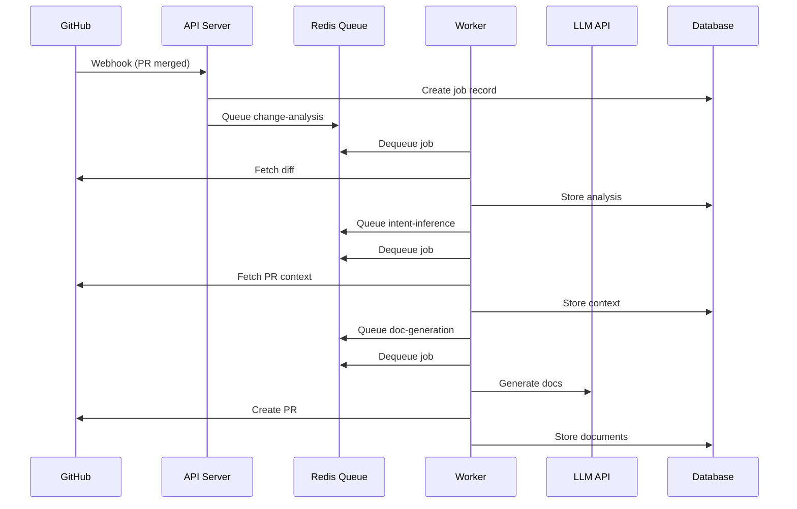

# Architecture

DocSynth is built as a modular monorepo with clear separation of concerns.

## System Overview

```
┌─────────────────────────────────────────────────────────────────────────────┐
│                              External Services                               │
├─────────────┬─────────────┬─────────────┬─────────────┬─────────────────────┤
│   GitHub    │    Jira     │    Slack    │   Linear    │    LLM APIs         │
└──────┬──────┴──────┬──────┴──────┬──────┴──────┬──────┴──────────┬──────────┘
       │             │             │             │                 │
       ▼             ▼             ▼             ▼                 ▼
┌─────────────────────────────────────────────────────────────────────────────┐
│                                API Server                                    │
│                               (Hono, Port 3001)                              │
│  ┌──────────┐  ┌──────────┐  ┌──────────┐  ┌──────────┐  ┌──────────┐       │
│  │ Webhooks │  │   Auth   │  │  Routes  │  │ Services │  │   MCP    │       │
│  └──────────┘  └──────────┘  └──────────┘  └──────────┘  └──────────┘       │
└───────────────────────────────────┬─────────────────────────────────────────┘
                                    │
                    ┌───────────────┼───────────────┐
                    │               │               │
                    ▼               ▼               ▼
             ┌───────────┐   ┌───────────┐   ┌───────────┐
             │ PostgreSQL│   │   Redis   │   │   Worker  │
             │ (Database)│   │  (Queue)  │   │ (BullMQ)  │
             └───────────┘   └───────────┘   └─────┬─────┘
                                                   │
                    ┌──────────────────────────────┼──────────────────────────┐
                    │              Worker Processors                          │
                    ├─────────────┬─────────────┬─────────────┬──────────────┤
                    │   Change    │   Intent    │    Doc      │     Doc      │
                    │  Analysis   │  Inference  │ Generation  │   Review     │
                    └─────────────┴─────────────┴─────────────┴──────────────┘
```

## Component Details

### API Server (apps/api)

The API server handles all HTTP requests:

**Framework:** Hono (lightweight, fast)  
**Port:** 3001

**Key Responsibilities:**
- Receive GitHub webhooks
- Handle authentication (GitHub OAuth, JWT)
- Serve REST API endpoints
- WebSocket connections for real-time updates

**Route Categories:**

| Category | Examples |
|----------|----------|
| Core | `/health`, `/auth`, `/webhooks` |
| Resources | `/repositories`, `/documents`, `/jobs` |
| Analytics | `/analytics`, `/health`, `/coverage` |
| Features | `/chat`, `/diagrams`, `/translations` |

### Web Dashboard (apps/web)

The web dashboard provides a UI for monitoring and configuration:

**Framework:** Next.js  
**Port:** 3000

**Pages:**
- Dashboard — Overview and quick stats
- Documents — Browse generated docs
- Analytics — Usage metrics
- Health — Documentation health monitoring
- Settings — Configuration and integrations

### Worker (apps/worker)

Background job processor:

**Queue:** BullMQ (Redis-backed)

**Processors:**

| Worker | Purpose |
|--------|---------|
| `change-analysis` | Parse code diffs |
| `intent-inference` | Gather external context |
| `doc-generation` | Generate documentation |
| `doc-review` | AI review of generated docs |
| `drift-scan` | Detect outdated docs |
| `health-scan` | Calculate health scores |
| `vector-index` | Build search embeddings |

### CLI (apps/cli)

Command-line interface:

**Framework:** Commander.js

**Commands:**
- `init` — Initialize repository
- `generate` — Local doc generation
- `status` — Check configuration
- `config` — Manage settings
- `login` — Authentication

### VS Code Extension (apps/vscode-extension)

IDE integration:

**Features:**
- Real-time documentation preview
- Inline suggestions
- Health status in sidebar
- Chat interface

## Shared Packages

### packages/database

Prisma ORM and database schema:

```
packages/database/
├── prisma/
│   └── schema.prisma    # Database schema
├── src/
│   └── client.ts        # Prisma client
└── package.json
```

### packages/types

Shared TypeScript types:

```typescript
// Core entities
interface Repository { ... }
interface Document { ... }
interface Job { ... }

// Enums
type DocumentType = 'README' | 'API' | 'CHANGELOG' | ...
type JobStatus = 'PENDING' | 'ANALYZING' | ...
```

### packages/queue

BullMQ queue configuration:

```typescript
// Queue definitions
export const changeAnalysisQueue = new Queue('change-analysis');
export const docGenerationQueue = new Queue('doc-generation');
```

### packages/github

GitHub API client:

```typescript
// GitHub operations
export async function getPullRequest(...)
export async function createPullRequest(...)
export async function getFileContents(...)
```

### packages/config

Configuration utilities:

```typescript
// Load and validate config
export function loadConfig(path: string): DocsynthConfig
export function validateConfig(config: unknown): boolean
```

### packages/utils

Shared utilities:

```typescript
// Common helpers
export function matchGlob(path: string, pattern: string): boolean
export function parseMarkdown(content: string): ParsedMarkdown
```

## Data Flow

### PR Merge Flow



## Database Schema

### Core Tables

```
┌─────────────────┐     ┌─────────────────┐
│  organizations  │────<│     users       │
└────────┬────────┘     └─────────────────┘
         │
         │              ┌─────────────────┐
         └─────────────<│  repositories   │
                        └────────┬────────┘
                                 │
              ┌──────────────────┼──────────────────┐
              │                  │                  │
              ▼                  ▼                  ▼
       ┌───────────┐      ┌───────────┐      ┌───────────┐
       │   jobs    │      │ documents │      │  webhooks │
       └───────────┘      └───────────┘      └───────────┘
```

### Key Relationships

| Table | Relationship |
|-------|-------------|
| `organizations` | Has many `repositories`, `users` |
| `repositories` | Has many `documents`, `jobs` |
| `jobs` | Belongs to `repository`, creates `documents` |
| `documents` | Belongs to `repository`, has `history` |

## Scaling Considerations

### Horizontal Scaling

**API Server:**
- Stateless, can run multiple instances
- Use load balancer for distribution

**Workers:**
- Scale independently based on queue depth
- Each worker processes one job at a time

```bash
# Scale workers
docker-compose up -d --scale worker=5
```

### Database Scaling

- Connection pooling (PgBouncer)
- Read replicas for analytics queries
- Partitioning for large tables (jobs, documents)

### Redis Scaling

- Redis Cluster for high availability
- Separate instances for queue and cache

## Security Architecture

### Authentication Flow

```
User → GitHub OAuth → JWT Token → API Requests
```

### Webhook Security

```
GitHub → HMAC Signature → Verify → Process
```

### Data Security

- Encryption at rest (database)
- TLS for all connections
- Secrets in environment variables
- Audit logging for sensitive operations

## Next Steps

- [Self-Hosting](/docs/guides/self-hosting) — Deploy DocSynth
- [Processing Pipeline](/docs/core-concepts/processing-pipeline) — Pipeline details
