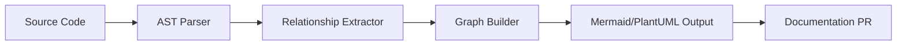
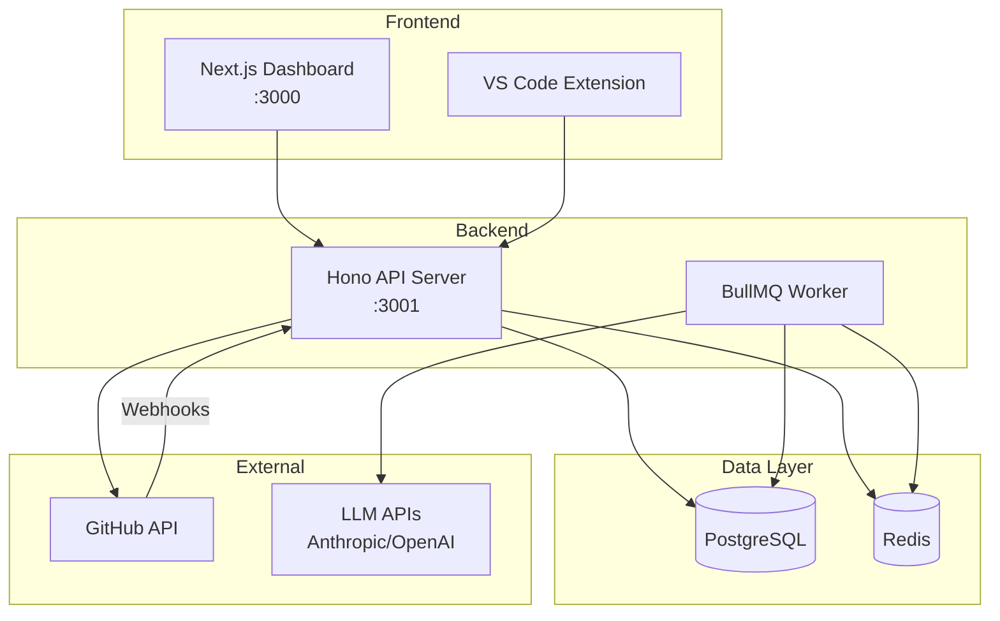
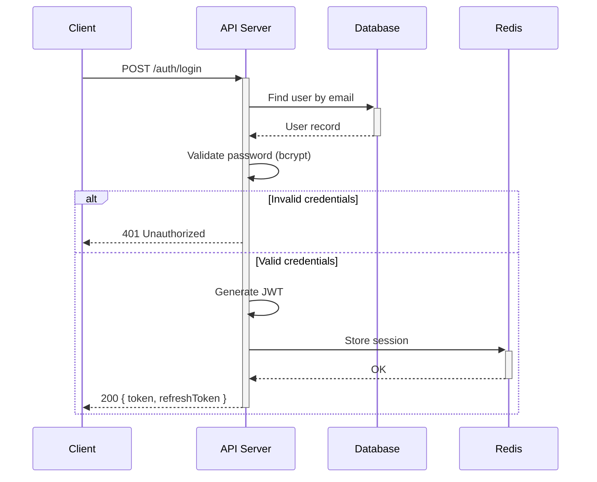
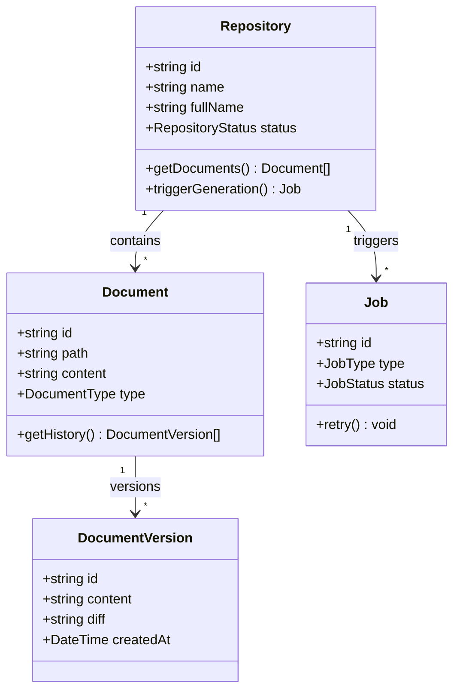
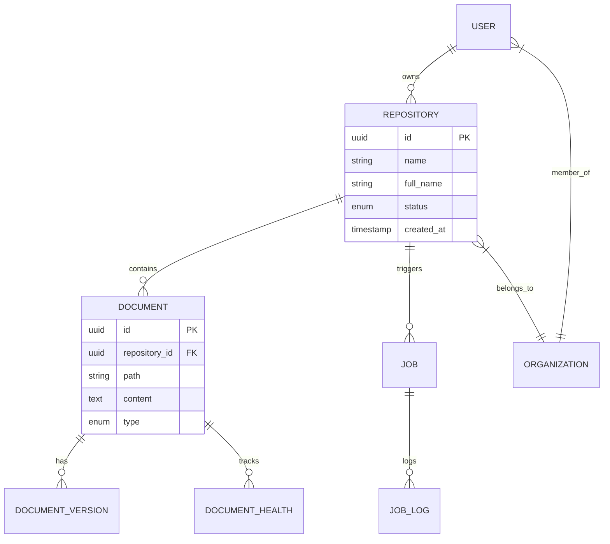
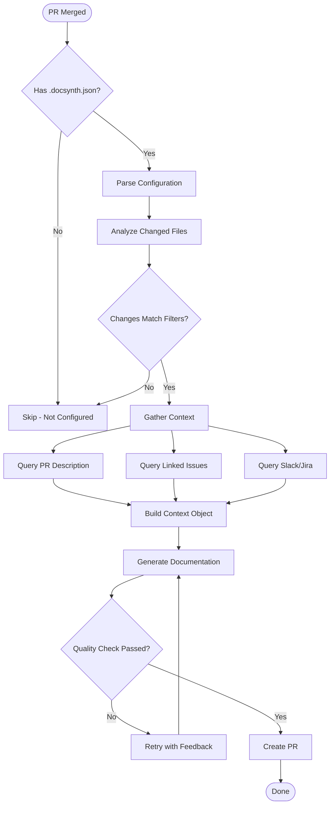

# Diagram Generation

DocSynth automatically generates visual diagrams from your code, helping teams understand system architecture, data flows, and component relationships without manual diagram maintenance.

## Supported Diagram Types

| Type | Description | Best For |
|------|-------------|----------|
| **Architecture** | System component overview showing services, databases, and connections | Understanding system topology |
| **Sequence** | Request/response flows between components | API documentation, debugging |
| **Class** | Class relationships, inheritance, composition | OOP codebases, domain models |
| **ERD** | Database entity relationships | Database documentation |
| **Flow** | Process flowcharts for business logic | Complex algorithms, workflows |
| **Dependency** | Module/package dependency graphs | Monorepos, microservices |

## How It Works

DocSynth analyzes your code using AST parsing to detect:

1. **Imports and exports** — Module dependencies and boundaries
2. **Class definitions** — Inheritance, interfaces, composition
3. **Function calls** — Inter-service communication patterns
4. **Database schemas** — Prisma, TypeORM, or raw SQL migrations
5. **API routes** — HTTP endpoints and their handlers



## Configuration

### Basic Setup

Enable diagram generation in your `.docsynth.json`:

```json
{
  "docTypes": {
    "diagrams": true
  },
  "advanced": {
    "diagrams": {
      "types": ["architecture", "sequence", "erd"],
      "format": "mermaid",
      "includeInDocs": true
    }
  }
}
```

### Full Configuration Reference

```json
{
  "advanced": {
    "diagrams": {
      "types": ["architecture", "sequence", "class", "erd", "flow", "dependency"],
      "format": "mermaid",
      "includeInDocs": true,
      "maxNodes": 30,
      "maxDepth": 4,
      "groupByPackage": true,
      "groupByDirectory": false,
      "excludePatterns": [
        "**/test/**",
        "**/node_modules/**",
        "**/*.spec.ts"
      ],
      "includePatterns": [
        "src/**/*.ts",
        "lib/**/*.ts"
      ],
      "outputDir": "docs/diagrams",
      "theme": "default",
      "direction": "TB"
    }
  }
}
```

### Configuration Options

| Option | Type | Default | Description |
|--------|------|---------|-------------|
| `types` | string[] | `["architecture"]` | Diagram types to generate |
| `format` | string | `"mermaid"` | Output format: `mermaid` or `plantuml` |
| `includeInDocs` | boolean | `true` | Embed diagrams in markdown files |
| `maxNodes` | number | `30` | Maximum nodes per diagram (prevents clutter) |
| `maxDepth` | number | `4` | Max nesting depth for dependencies |
| `groupByPackage` | boolean | `true` | Group components by package/module |
| `excludePatterns` | string[] | `[]` | Glob patterns to exclude |
| `includePatterns` | string[] | `["**/*"]` | Glob patterns to include |
| `outputDir` | string | `"docs"` | Where to save diagram files |
| `theme` | string | `"default"` | Mermaid theme: `default`, `dark`, `forest`, `neutral` |
| `direction` | string | `"TB"` | Graph direction: `TB`, `BT`, `LR`, `RL` |

## Generated Output Examples

### Architecture Diagram

For a typical web application:



### Sequence Diagram

For an authentication flow:



### Class Diagram

For domain models:



### Entity Relationship Diagram

For database schemas:



### Flow Diagram

For business logic:



## Diagram Placement in Documentation

DocSynth can automatically insert diagrams into your markdown documentation using special markers:

```markdown
# System Architecture

This document describes our system architecture.

<!-- docsynth:diagram type="architecture" -->
<!-- The diagram will be auto-generated here -->
<!-- /docsynth:diagram -->

## Authentication Flow

<!-- docsynth:diagram type="sequence" name="auth-flow" -->
<!-- /docsynth:diagram -->
```

### Marker Options

| Attribute | Description |
|-----------|-------------|
| `type` | Required. Diagram type to generate |
| `name` | Optional. Specific diagram name for targeting |
| `scope` | Optional. Limit to specific paths: `scope="src/auth/**"` |
| `depth` | Optional. Override max depth for this diagram |

## API Access

Generate diagrams programmatically:

```typescript
import { DocSynth } from '@docsynth/sdk';

const client = new DocSynth({ token: 'YOUR_TOKEN' });

// Generate a specific diagram type
const diagram = await client.diagrams.generate({
  repositoryId: 'repo_123',
  type: 'architecture',
  options: {
    maxNodes: 25,
    groupByPackage: true,
  },
});

console.log(diagram.mermaid); // Mermaid source code
console.log(diagram.svg);     // Rendered SVG
```

### CLI Usage

```bash
# Generate all configured diagrams
docsynth diagrams generate

# Generate a specific type
docsynth diagrams generate --type architecture

# Generate with custom options
docsynth diagrams generate --type sequence --max-nodes 40 --output ./docs

# Preview without saving
docsynth diagrams preview --type erd
```

## Limitations

- **Maximum complexity**: Diagrams with more than 50 nodes may become difficult to read. Use `maxNodes` to limit.
- **Dynamic code**: Heavily dynamic patterns (reflection, eval) may not be detected accurately.
- **External services**: Services without local code won't appear unless explicitly configured.
- **Real-time sync**: Diagrams update on PR merge, not in real-time during development.

## Best Practices

1. **Start small** — Enable one diagram type first, then expand
2. **Use filters** — Exclude test files and third-party code
3. **Group logically** — Enable `groupByPackage` for cleaner diagrams
4. **Review regularly** — Diagrams are auto-generated but benefit from human review
5. **Combine with text** — Diagrams complement written documentation, don't replace it

## Troubleshooting

### Diagram is too cluttered

Reduce `maxNodes` or use `excludePatterns` to filter out less important components:

```json
{
  "advanced": {
    "diagrams": {
      "maxNodes": 15,
      "excludePatterns": ["**/utils/**", "**/helpers/**"]
    }
  }
}
```

### Missing components

Check that your `includePatterns` cover the relevant directories:

```json
{
  "advanced": {
    "diagrams": {
      "includePatterns": ["src/**/*.ts", "lib/**/*.ts", "packages/**/*.ts"]
    }
  }
}
```

### Diagram not updating

Ensure the changed files match your filters and that diagram generation is enabled for the relevant doc type.
