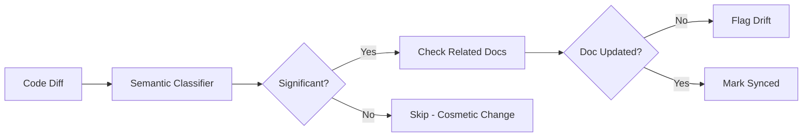

# Drift Detection

Drift detection identifies documentation that has fallen out of sync with code changes, helping teams maintain accurate and up-to-date documentation.

## The Problem

Documentation drift is when docs no longer accurately reflect the code they describe. This happens when:
- Code changes but docs aren't updated
- APIs are modified without updating the reference
- Features are added/removed without doc changes
- Refactoring changes behavior described in docs

Studies show that **54% of documentation becomes stale within 3 months** of being written. Drift detection catches this automatically.

## How Drift Detection Works

DocSynth uses multiple signals to detect drift:

### 1. Temporal Analysis

Compares timestamps between documentation and the code it describes:

```
docs/api/users.md
├── Last documentation update: January 1
├── Documents code in: src/api/users.ts
├── Last code change: January 15
└── Drift period: 14 days ← POTENTIAL DRIFT
```

### 2. Semantic Analysis

Uses AI to detect if code changes are semantically significant:



**Types of changes analyzed:**
- Function signatures (parameters, return types)
- Public API changes (new endpoints, modified routes)
- Configuration option changes
- Error codes and messages
- Default values and behaviors

### 3. Link Validation

Checks that documentation links and references are still valid:
- Code references (`@see`, inline code blocks)
- File paths mentioned in docs
- API endpoint URLs
- Configuration examples

### 4. Freshness Scoring

Each document gets a freshness score (0-100):

| Score | Status | Meaning |
|-------|--------|---------|
| 90-100 | 🟢 Fresh | Updated within threshold, matches code |
| 70-89 | 🟡 Aging | May need review, minor drift |
| 50-69 | 🟠 Stale | Significant drift detected |
| 0-49 | 🔴 Outdated | Major drift, likely inaccurate |

**Score calculation:**

```
Freshness = 100 - (timeDriftPenalty + semanticDriftPenalty + linkBrokenPenalty)

Where:
- timeDriftPenalty = min(50, daysOutdated × 2)
- semanticDriftPenalty = significantChanges × 10
- linkBrokenPenalty = brokenLinks × 5
```

## Configuration

### Basic Setup

Enable drift detection in `.docsynth.json`:

```json
{
  "advanced": {
    "driftDetection": {
      "enabled": true,
      "scanFrequency": "daily",
      "thresholdDays": 14
    }
  }
}
```

### Full Configuration Reference

```json
{
  "advanced": {
    "driftDetection": {
      "enabled": true,
      "scanFrequency": "daily",
      "thresholdDays": 14,
      "semanticAnalysis": true,
      "linkValidation": true,
      "alertOnDrift": true,
      "alertThreshold": "warning",
      "autoRegenerate": false,
      "ignorePatterns": [
        "**/changelog.md",
        "**/HISTORY.md"
      ],
      "docCodeMapping": {
        "docs/api/**": "src/api/**",
        "docs/guides/**": "src/**"
      },
      "notifications": {
        "slack": true,
        "email": true,
        "webhook": true
      }
    }
  }
}
```

### Configuration Options

| Option | Type | Default | Description |
|--------|------|---------|-------------|
| `enabled` | boolean | `false` | Enable drift detection |
| `scanFrequency` | string | `"daily"` | Scan frequency: `hourly`, `daily`, `weekly` |
| `thresholdDays` | number | `14` | Days before flagging drift |
| `semanticAnalysis` | boolean | `true` | Use AI for semantic drift detection |
| `linkValidation` | boolean | `true` | Check for broken links/references |
| `alertOnDrift` | boolean | `true` | Send notifications on drift |
| `alertThreshold` | string | `"warning"` | Minimum severity: `info`, `warning`, `critical` |
| `autoRegenerate` | boolean | `false` | Auto-create doc update PRs |
| `ignorePatterns` | string[] | `[]` | Files to exclude from scanning |
| `docCodeMapping` | object | auto | Map doc paths to code paths |
| `notifications` | object | all true | Notification channels |

### Document-Code Mapping

DocSynth auto-detects which code files a document describes by:

1. **Explicit references** — `@see src/api/users.ts`
2. **Code blocks** — Analyzing code snippets in the doc
3. **File naming** — `docs/api/users.md` → `src/api/users.ts`
4. **Knowledge graph** — Using extracted relationships

You can also specify explicit mappings:

```json
{
  "advanced": {
    "driftDetection": {
      "docCodeMapping": {
        "docs/api/authentication.md": [
          "src/services/auth.service.ts",
          "src/middleware/auth.middleware.ts"
        ],
        "docs/guides/getting-started.md": "src/**/*.ts"
      }
    }
  }
}
```

## Drift Alerts

### Severity Levels

| Level | Trigger | Action |
|-------|---------|--------|
| **Info** | Minor code changes, still within threshold | Logged in dashboard |
| **Warning** | Threshold exceeded or semantic changes | Notification sent |
| **Critical** | Major API changes or broken links | Immediate notification + auto-PR option |

### Notification Channels

#### Dashboard

All drift alerts appear in **Health → Drift Alerts**:

| Document | Status | Last Doc Update | Last Code Change | Drift | Actions |
|----------|--------|-----------------|------------------|-------|---------|
| api/users.md | 🔴 Critical | 30 days ago | 2 days ago | 28 days | [Regenerate] [Dismiss] |
| api/auth.md | 🟡 Warning | 10 days ago | 3 days ago | 7 days | [Review] [Dismiss] |
| guides/setup.md | 🟢 Fresh | 5 days ago | 5 days ago | Synced | — |

#### Slack

```
🚨 Documentation Drift Detected

Repository: acme/my-project
Document: docs/api/users.md
Drift: 28 days (threshold: 14 days)
Reason: Code changes in src/api/users.ts not reflected in documentation

Changes detected:
• New parameter `includeDeleted` added to getUsers()
• Return type changed from User[] to PaginatedResponse<User>
• New endpoint POST /users/bulk added

[View in Dashboard] [Regenerate Docs] [Dismiss]
```

#### Webhook

```json
{
  "event": "drift.detected",
  "timestamp": "2026-02-01T10:30:00Z",
  "repository": {
    "id": "repo_abc123",
    "name": "my-project"
  },
  "drift": {
    "documentPath": "docs/api/users.md",
    "severity": "critical",
    "freshnessScore": 35,
    "daysOutdated": 28,
    "codeChanges": [
      {
        "file": "src/api/users.ts",
        "changedAt": "2026-01-15T14:22:00Z",
        "significantChanges": [
          "New parameter: includeDeleted",
          "Changed return type"
        ]
      }
    ],
    "brokenLinks": []
  }
}
```

## API Reference

### Get Drift Status

```bash
GET /api/v1/health/drift?repositoryId=repo_123
```

**Query Parameters:**

| Parameter | Type | Description |
|-----------|------|-------------|
| `repositoryId` | string | Required. Repository ID |
| `severity` | string | Filter by severity: `info`, `warning`, `critical` |
| `path` | string | Filter by doc path pattern |

**Response:**

```json
{
  "data": {
    "summary": {
      "total": 45,
      "fresh": 38,
      "warning": 5,
      "critical": 2,
      "averageFreshness": 82
    },
    "documents": [
      {
        "path": "docs/api/users.md",
        "freshnessScore": 35,
        "severity": "critical",
        "lastDocUpdate": "2026-01-01T00:00:00Z",
        "lastCodeChange": "2026-01-15T14:22:00Z",
        "daysOutdated": 28,
        "relatedCode": ["src/api/users.ts"],
        "significantChanges": [
          "New parameter: includeDeleted",
          "Changed return type"
        ],
        "brokenLinks": []
      }
    ]
  }
}
```

### Acknowledge Drift

Mark drift as reviewed without regenerating:

```bash
POST /api/v1/health/drift/acknowledge
```

```json
{
  "repositoryId": "repo_123",
  "documentPath": "docs/api/users.md",
  "reason": "Intentionally outdated - deprecation notice added"
}
```

### Trigger Regeneration

Request doc regeneration for drifted document:

```bash
POST /api/v1/documents/regenerate
```

```json
{
  "repositoryId": "repo_123",
  "documentPath": "docs/api/users.md",
  "createPR": true
}
```

## CLI Usage

```bash
# Check drift status for repository
docsynth drift status

# Show details for specific document
docsynth drift show docs/api/users.md

# List all drifted documents
docsynth drift list --severity warning

# Regenerate drifted document
docsynth drift fix docs/api/users.md

# Acknowledge drift (mark as intentional)
docsynth drift acknowledge docs/api/users.md --reason "Deprecated API"

# Run full drift scan
docsynth drift scan --full
```

## Resolving Drift

### Option 1: Regenerate Documentation

Let DocSynth update the documentation automatically:

```bash
docsynth drift fix docs/api/users.md
```

This will:
1. Analyze the code changes
2. Generate updated documentation
3. Create a PR for review

### Option 2: Manual Update

Edit the documentation yourself:

```bash
# View what changed in the code
docsynth drift diff docs/api/users.md

# Opens your editor with suggested changes
docsynth drift edit docs/api/users.md
```

### Option 3: Acknowledge/Dismiss

Mark drift as intentional (e.g., for deprecated features):

```bash
docsynth drift acknowledge docs/api/users.md \
  --reason "API deprecated, removal scheduled for v3.0"
```

### Option 4: Update Mapping

If the doc-code mapping is wrong:

```json
{
  "advanced": {
    "driftDetection": {
      "docCodeMapping": {
        "docs/api/users.md": "src/controllers/user.controller.ts"
      }
    }
  }
}
```

## Best Practices

### 1. Set Appropriate Thresholds

- **Fast-moving codebases**: 7 days
- **Stable codebases**: 30 days
- **Documentation-critical projects**: 3-5 days

### 2. Exclude Generated Docs

Don't scan auto-generated files:

```json
{
  "ignorePatterns": [
    "**/api-reference/generated/**",
    "**/CHANGELOG.md"
  ]
}
```

### 3. Use Semantic Analysis

Enable semantic analysis to avoid false positives from cosmetic changes:

```json
{
  "semanticAnalysis": true
}
```

### 4. Configure Auto-Regeneration Carefully

Auto-regeneration is powerful but should be reviewed:

```json
{
  "autoRegenerate": true,
  "autoRegenerateThreshold": "critical"  // Only auto-fix critical drift
}
```

### 5. Integrate with CI/CD

Add drift checks to your CI pipeline:

```yaml
# .github/workflows/docs.yml
- name: Check documentation drift
  run: docsynth drift status --fail-on warning
```

## Troubleshooting

### False Positives

If cosmetic changes trigger drift alerts:

1. Enable `semanticAnalysis` to filter noise
2. Add patterns to `ignorePatterns` for frequently-changed files
3. Adjust `thresholdDays` to allow more buffer

### Missing Drift Detection

If real drift isn't being caught:

1. Check `docCodeMapping` is correct
2. Verify the document has code references
3. Run `docsynth drift scan --full` for manual scan

### Performance Issues

For large repositories:

1. Use `weekly` scan frequency instead of `daily`
2. Narrow `docCodeMapping` to specific paths
3. Use `ignorePatterns` to exclude irrelevant docs
