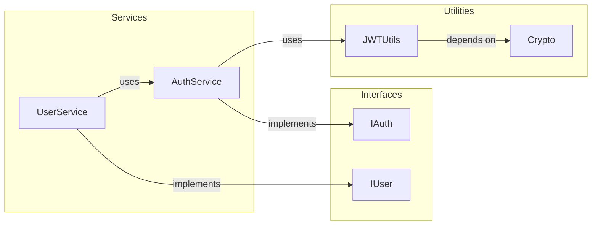
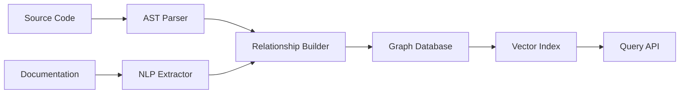

# Knowledge Graphs

DocSynth extracts relationships from your codebase and documentation to build a navigable knowledge graph—enabling semantic search, impact analysis, and intelligent documentation navigation.

## What is a Knowledge Graph?

A knowledge graph represents entities (functions, classes, modules, documents) and their relationships as a connected network:



Unlike traditional documentation structure (folders and files), knowledge graphs let you navigate by **concept** and **relationship**, answering questions like:
- "What depends on this function?"
- "What code does this documentation describe?"
- "What's related to authentication?"

## How It Works

DocSynth builds knowledge graphs through:

1. **Code Analysis** — AST parsing to extract entities and their static relationships
2. **Semantic Analysis** — LLM-powered understanding of what code does conceptually
3. **Documentation Linking** — Connecting docs to the code they describe
4. **Vector Embeddings** — Semantic similarity for "related concepts"



## Configuration

### Basic Setup

Enable knowledge graphs in `.docsynth.json`:

```json
{
  "advanced": {
    "knowledgeGraph": {
      "enabled": true,
      "extractRelationships": true
    }
  }
}
```

### Full Configuration Reference

```json
{
  "advanced": {
    "knowledgeGraph": {
      "enabled": true,
      "extractRelationships": true,
      "includeTypes": [
        "class",
        "interface",
        "function",
        "type",
        "enum",
        "module",
        "document"
      ],
      "excludePatterns": [
        "**/test/**",
        "**/node_modules/**"
      ],
      "maxDepth": 5,
      "semanticSimilarity": true,
      "similarityThreshold": 0.7,
      "autoLink": true,
      "indexSchedule": "on-change"
    }
  }
}
```

### Configuration Options

| Option | Type | Default | Description |
|--------|------|---------|-------------|
| `enabled` | boolean | `false` | Enable knowledge graph extraction |
| `extractRelationships` | boolean | `true` | Extract code relationships |
| `includeTypes` | string[] | `["class", "function", "interface"]` | Entity types to include |
| `excludePatterns` | string[] | `[]` | Glob patterns to exclude |
| `maxDepth` | number | `5` | Maximum relationship traversal depth |
| `semanticSimilarity` | boolean | `true` | Enable semantic similarity edges |
| `similarityThreshold` | number | `0.7` | Minimum similarity score (0-1) |
| `autoLink` | boolean | `true` | Auto-link docs to code |
| `indexSchedule` | string | `"on-change"` | When to rebuild: `on-change`, `daily`, `weekly` |

## Extracted Relationships

### Code Relationships

| Relationship | Description | Example |
|-------------|-------------|---------|
| `calls` | Function calls another function | `login()` calls `validatePassword()` |
| `implements` | Class implements interface | `AuthService` implements `IAuthService` |
| `extends` | Class extends another class | `AdminUser` extends `User` |
| `imports` | Module imports another module | `auth.ts` imports `jwt.ts` |
| `uses` | Entity uses another entity | `UserController` uses `UserService` |
| `dependsOn` | Package depends on package | `@app/api` depends on `@app/database` |
| `returns` | Function returns type | `getUser()` returns `User` |
| `accepts` | Function accepts parameter type | `createUser()` accepts `CreateUserDTO` |

### Documentation Relationships

| Relationship | Description | Example |
|-------------|-------------|---------|
| `documents` | Doc describes code entity | `api-guide.md` documents `APIController` |
| `references` | Doc references another doc | `auth.md` references `jwt.md` |
| `relatedTo` | Semantically similar content | Auth guide related to Security guide |
| `prerequisite` | Doc requires reading first | Tutorial 2 prerequisite Tutorial 1 |

## API Reference

### Query the Knowledge Graph

```bash
GET /api/v1/knowledge-graph
```

**Query Parameters:**

| Parameter | Type | Description |
|-----------|------|-------------|
| `repositoryId` | string | Required. Repository ID |
| `entityId` | string | Filter by specific entity |
| `entityType` | string | Filter by type: `class`, `function`, etc. |
| `relationship` | string | Filter by relationship type |
| `depth` | number | Traversal depth (default: 2) |
| `limit` | number | Max results (default: 100) |

**Example Request:**

```bash
curl "https://api.docsynth.dev/api/v1/knowledge-graph?repositoryId=repo_abc123&entityType=class&depth=2" \
  -H "Authorization: Bearer YOUR_TOKEN"
```

**Example Response:**

```json
{
  "data": {
    "nodes": [
      {
        "id": "node_auth_service",
        "entityId": "AuthService",
        "type": "class",
        "file": "src/services/auth.service.ts",
        "line": 15,
        "description": "Handles user authentication and session management",
        "metadata": {
          "methods": ["login", "logout", "validateToken"],
          "linesOfCode": 142
        }
      },
      {
        "id": "node_jwt_utils",
        "entityId": "JWTUtils",
        "type": "class",
        "file": "src/utils/jwt.ts",
        "line": 8,
        "description": "JWT token generation and validation utilities"
      },
      {
        "id": "node_auth_doc",
        "entityId": "authentication-guide",
        "type": "document",
        "file": "docs/guides/authentication.md",
        "description": "Guide for implementing authentication"
      }
    ],
    "edges": [
      {
        "id": "edge_1",
        "source": "node_auth_service",
        "target": "node_jwt_utils",
        "relationship": "uses",
        "confidence": 1.0
      },
      {
        "id": "edge_2",
        "source": "node_auth_doc",
        "target": "node_auth_service",
        "relationship": "documents",
        "confidence": 0.95
      }
    ],
    "meta": {
      "nodeCount": 3,
      "edgeCount": 2,
      "maxDepth": 2
    }
  }
}
```

### Find Related Entities

```bash
GET /api/v1/knowledge-graph/related
```

Find entities related to a specific entity:

```bash
curl "https://api.docsynth.dev/api/v1/knowledge-graph/related?repositoryId=repo_abc123&entityId=AuthService" \
  -H "Authorization: Bearer YOUR_TOKEN"
```

**Response:**

```json
{
  "data": {
    "entity": {
      "id": "AuthService",
      "type": "class"
    },
    "related": [
      {
        "entity": { "id": "JWTUtils", "type": "class" },
        "relationship": "uses",
        "direction": "outgoing"
      },
      {
        "entity": { "id": "UserService", "type": "class" },
        "relationship": "uses",
        "direction": "incoming"
      },
      {
        "entity": { "id": "authentication-guide", "type": "document" },
        "relationship": "documents",
        "direction": "incoming"
      }
    ]
  }
}
```

### Semantic Search

Search the knowledge graph by natural language:

```bash
POST /api/v1/knowledge-graph/search
```

```json
{
  "repositoryId": "repo_abc123",
  "query": "How does authentication work?",
  "types": ["class", "function", "document"],
  "limit": 10
}
```

**Response:**

```json
{
  "data": {
    "results": [
      {
        "entity": {
          "id": "AuthService",
          "type": "class",
          "file": "src/services/auth.service.ts"
        },
        "score": 0.94,
        "snippet": "Handles user authentication and session management"
      },
      {
        "entity": {
          "id": "authentication-guide",
          "type": "document",
          "file": "docs/guides/authentication.md"
        },
        "score": 0.91,
        "snippet": "This guide explains how to implement authentication..."
      }
    ]
  }
}
```

### Impact Analysis

Analyze what would be affected by changing an entity:

```bash
GET /api/v1/knowledge-graph/impact?repositoryId=repo_abc123&entityId=JWTUtils
```

**Response:**

```json
{
  "data": {
    "entity": { "id": "JWTUtils", "type": "class" },
    "directDependents": [
      { "id": "AuthService", "type": "class", "relationship": "uses" },
      { "id": "TokenRefreshJob", "type": "class", "relationship": "uses" }
    ],
    "transitiveDependents": [
      { "id": "LoginController", "type": "class", "depth": 2 },
      { "id": "UserService", "type": "class", "depth": 2 }
    ],
    "affectedDocuments": [
      { "id": "authentication-guide", "file": "docs/guides/authentication.md" },
      { "id": "api-reference", "file": "docs/api/auth.md" }
    ],
    "summary": {
      "directImpact": 2,
      "transitiveImpact": 4,
      "documentsToUpdate": 2
    }
  }
}
```

## Dashboard Visualization

The web dashboard provides an interactive graph explorer:

### Features

- **Pan and zoom** — Navigate large graphs
- **Click to focus** — Click a node to see its relationships
- **Filter by type** — Show only classes, functions, or documents
- **Search** — Find entities by name
- **Path finding** — Find connections between two entities
- **Export** — Download as SVG, PNG, or JSON

### Accessing the Dashboard

1. Log in to the [DocSynth Dashboard](https://app.docsynth.dev)
2. Select your repository
3. Click **Knowledge Graph** in the sidebar

## SDK Usage

```typescript
import { DocSynth } from '@docsynth/sdk';

const client = new DocSynth({ token: 'YOUR_TOKEN' });

// Query the graph
const graph = await client.knowledgeGraph.query({
  repositoryId: 'repo_123',
  entityType: 'class',
  depth: 2,
});

// Semantic search
const results = await client.knowledgeGraph.search({
  repositoryId: 'repo_123',
  query: 'user authentication flow',
  limit: 10,
});

// Impact analysis
const impact = await client.knowledgeGraph.analyzeImpact({
  repositoryId: 'repo_123',
  entityId: 'UserService',
});

console.log(`Changing UserService affects ${impact.summary.transitiveImpact} entities`);
```

## CLI Usage

```bash
# View graph summary
docsynth graph stats

# Search the graph
docsynth graph search "authentication"

# Find entity relationships
docsynth graph show AuthService --depth 2

# Analyze impact of changes
docsynth graph impact AuthService

# Export graph data
docsynth graph export --format json --output graph.json
```

## Use Cases

### 1. Onboarding New Developers

New team members can explore the knowledge graph to understand:
- Which services talk to each other
- Where to find documentation for specific features
- How different parts of the codebase relate

### 2. Impact Analysis Before Refactoring

Before changing a core utility:
```bash
docsynth graph impact JWTUtils
# Shows: 12 entities depend on JWTUtils, 3 docs need updating
```

### 3. Finding Documentation Gaps

Identify undocumented code:
```bash
docsynth graph gaps
# Shows: 15 public classes have no linked documentation
```

### 4. Smart Documentation Links

DocSynth uses the graph to suggest relevant links:
- "See also: AuthService, JWTUtils"
- "Related guides: Authentication, Security"

## Performance Considerations

| Repository Size | Initial Indexing | Incremental Updates |
|----------------|------------------|---------------------|
| Small (\<10k LOC) | ~30 seconds | ~5 seconds |
| Medium (10k-100k LOC) | ~5 minutes | ~30 seconds |
| Large (100k-1M LOC) | ~30 minutes | ~2 minutes |
| Enterprise (\>1M LOC) | ~2 hours | ~10 minutes |

### Optimization Tips

1. **Use `excludePatterns`** — Skip test files and vendor code
2. **Limit `includeTypes`** — Focus on the entity types you care about
3. **Set appropriate `maxDepth`** — Deeper graphs are slower to query
4. **Schedule wisely** — Use `daily` indexing for very large repos

## Limitations

- **Dynamic code** — Relationships created at runtime (reflection, eval) won't be detected
- **Cross-repository** — Graphs are per-repository; cross-repo relationships require Enterprise
- **Private methods** — Internal implementation details may not be indexed by default
- **Language support** — Full support for TypeScript/JavaScript, Python, Go; partial for others
