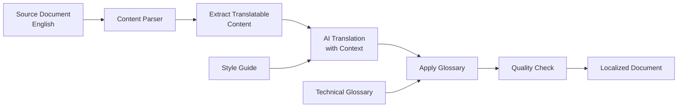

# Multi-Language Support

DocSynth automatically translates documentation to multiple languages, helping you reach a global audience without manual translation overhead.

## How It Works

DocSynth uses AI-powered translation that understands technical context:



**Key advantages over generic translation:**
- Technical terms are preserved or translated with domain-specific knowledge
- Code examples remain in original language
- Links are automatically updated for localized versions
- Formatting and structure are maintained perfectly

## Configuration

### Basic Setup

Enable translations in `.docsynth.json`:

```json
{
  "advanced": {
    "translations": {
      "enabled": true,
      "sourceLanguage": "en",
      "targetLanguages": ["es", "fr", "de", "ja"]
    }
  }
}
```

### Full Configuration Reference

```json
{
  "advanced": {
    "translations": {
      "enabled": true,
      "sourceLanguage": "en",
      "targetLanguages": ["es", "fr", "de", "ja", "zh", "ko", "pt"],
      "outputPath": "docs/i18n/{lang}",
      "glossary": {
        "enabled": true,
        "path": ".docsynth/glossary.json"
      },
      "qualityThreshold": 0.85,
      "preserveCodeBlocks": true,
      "translateCodeComments": false,
      "includePaths": ["docs/**/*.md"],
      "excludePaths": ["docs/api-reference/**"],
      "syncOnUpdate": true,
      "reviewRequired": false
    }
  }
}
```

### Configuration Options

| Option | Type | Default | Description |
|--------|------|---------|-------------|
| `enabled` | boolean | `false` | Enable translation feature |
| `sourceLanguage` | string | `"en"` | Source language code |
| `targetLanguages` | string[] | `[]` | Target language codes |
| `outputPath` | string | `"docs/i18n/{lang}"` | Output path template |
| `glossary.enabled` | boolean | `true` | Use technical glossary |
| `glossary.path` | string | `.docsynth/glossary.json` | Glossary file location |
| `qualityThreshold` | number | `0.85` | Minimum quality score (0-1) |
| `preserveCodeBlocks` | boolean | `true` | Keep code in original language |
| `translateCodeComments` | boolean | `false` | Translate comments in code |
| `includePaths` | string[] | `["**/*.md"]` | Files to translate |
| `excludePaths` | string[] | `[]` | Files to skip |
| `syncOnUpdate` | boolean | `true` | Auto-update on source changes |
| `reviewRequired` | boolean | `false` | Require human review |

## Supported Languages

### Fully Supported (High Quality)

| Code | Language | Native Name |
|------|----------|-------------|
| `en` | English | English |
| `es` | Spanish | Español |
| `fr` | French | Français |
| `de` | German | Deutsch |
| `ja` | Japanese | 日本語 |
| `zh` | Chinese (Simplified) | 简体中文 |
| `zh-TW` | Chinese (Traditional) | 繁體中文 |
| `ko` | Korean | 한국어 |
| `pt` | Portuguese | Português |
| `pt-BR` | Portuguese (Brazil) | Português (Brasil) |
| `it` | Italian | Italiano |
| `ru` | Russian | Русский |
| `nl` | Dutch | Nederlands |
| `pl` | Polish | Polski |
| `ar` | Arabic | العربية |
| `hi` | Hindi | हिन्दी |

### Experimental (Good Quality)

| Code | Language |
|------|----------|
| `tr` | Turkish |
| `vi` | Vietnamese |
| `th` | Thai |
| `id` | Indonesian |
| `uk` | Ukrainian |
| `cs` | Czech |
| `sv` | Swedish |
| `da` | Danish |
| `fi` | Finnish |
| `no` | Norwegian |

## Output Structure

Translated documents mirror the source structure:

```
docs/
├── getting-started.md          # English (source)
├── api/
│   └── authentication.md       # English (source)
└── i18n/
    ├── es/
    │   ├── getting-started.md  # Spanish
    │   └── api/
    │       └── authentication.md
    ├── fr/
    │   ├── getting-started.md  # French
    │   └── api/
    │       └── authentication.md
    ├── ja/
    │   ├── getting-started.md  # Japanese
    │   └── api/
    │       └── authentication.md
    └── zh/
        ├── getting-started.md  # Chinese
        └── api/
            └── authentication.md
```

## Technical Glossary

The glossary ensures consistent translation of technical terms across all documents.

### Creating a Glossary

Create `.docsynth/glossary.json`:

```json
{
  "terms": {
    "webhook": {
      "es": "webhook",
      "fr": "webhook",
      "de": "Webhook",
      "ja": "Webhook",
      "zh": "Webhook",
      "note": "Keep as-is in most languages"
    },
    "pull request": {
      "es": "pull request",
      "fr": "pull request",
      "de": "Pull Request",
      "ja": "プルリクエスト",
      "zh": "拉取请求"
    },
    "API endpoint": {
      "es": "endpoint de API",
      "fr": "point de terminaison API",
      "de": "API-Endpunkt",
      "ja": "APIエンドポイント",
      "zh": "API端点"
    },
    "authentication": {
      "es": "autenticación",
      "fr": "authentification",
      "de": "Authentifizierung",
      "ja": "認証",
      "zh": "身份验证"
    },
    "drift detection": {
      "es": "detección de desvío",
      "fr": "détection de dérive",
      "de": "Drift-Erkennung",
      "ja": "ドリフト検出",
      "zh": "漂移检测"
    }
  },
  "doNotTranslate": [
    "DocSynth",
    "GitHub",
    "Slack",
    "Jira",
    "API",
    "CLI",
    "SDK",
    "JWT",
    "OAuth"
  ]
}
```

### Glossary Format

| Field | Description |
|-------|-------------|
| `terms` | Object mapping English terms to translations |
| `doNotTranslate` | Array of terms to keep in English |

## Translation Quality

### Quality Scoring

Each translation receives a quality score (0-1):

| Score | Quality | Action |
|-------|---------|--------|
| 0.95+ | Excellent | Auto-publish |
| 0.85-0.94 | Good | Auto-publish (default threshold) |
| 0.70-0.84 | Acceptable | Flag for review |
| \<0.70 | Poor | Block, retry with different model |

**Score factors:**
- Glossary compliance
- Grammar and fluency
- Preserved formatting
- Link validity
- Technical accuracy

### Quality Reports

View translation quality in the dashboard or via API:

```bash
GET /api/v1/translations/quality?repositoryId=repo_123&language=es
```

```json
{
  "data": {
    "language": "es",
    "averageScore": 0.92,
    "documents": [
      {
        "path": "docs/getting-started.md",
        "score": 0.95,
        "issues": []
      },
      {
        "path": "docs/api/authentication.md",
        "score": 0.88,
        "issues": [
          {
            "type": "glossary_mismatch",
            "term": "webhook",
            "expected": "webhook",
            "found": "gancho web"
          }
        ]
      }
    ]
  }
}
```

## Content Control

### Exclude Content from Translation

Use markers to keep content in the source language:

```markdown
<!-- docsynth:no-translate -->
This content will remain in English in all translations.

Useful for:
- Code-heavy sections
- Brand names and trademarks
- Quotes that should stay original
<!-- /docsynth:no-translate -->
```

### Language-Specific Content

Add content that only appears in specific languages:

```markdown
<!-- docsynth:lang:ja -->
この情報は日本語版のみに表示されます。
This information only appears in the Japanese version.
<!-- /docsynth:lang:ja -->

<!-- docsynth:lang:!ja -->
This content appears in all languages EXCEPT Japanese.
<!-- /docsynth:lang:!ja -->
```

### Custom Translations

Override AI translation for specific sections:

```markdown
<!-- docsynth:translation:es -->
Esta es una traducción manual que anula la traducción automática.
<!-- /docsynth:translation:es -->
```

## API Reference

### List Translations

```bash
GET /api/v1/translations?repositoryId=repo_123
```

**Response:**

```json
{
  "data": {
    "sourceLanguage": "en",
    "targetLanguages": ["es", "fr", "ja"],
    "documents": [
      {
        "sourcePath": "docs/getting-started.md",
        "translations": [
          {
            "language": "es",
            "path": "docs/i18n/es/getting-started.md",
            "status": "completed",
            "qualityScore": 0.94,
            "lastUpdated": "2026-01-15T10:30:00Z"
          },
          {
            "language": "fr",
            "path": "docs/i18n/fr/getting-started.md",
            "status": "completed",
            "qualityScore": 0.91,
            "lastUpdated": "2026-01-15T10:32:00Z"
          }
        ]
      }
    ]
  }
}
```

### Trigger Translation

```bash
POST /api/v1/translations/generate
```

```json
{
  "repositoryId": "repo_123",
  "sourcePath": "docs/getting-started.md",
  "targetLanguages": ["es", "fr"],
  "force": false
}
```

### Update Glossary

```bash
PUT /api/v1/translations/glossary
```

```json
{
  "repositoryId": "repo_123",
  "terms": {
    "new term": {
      "es": "nuevo término",
      "fr": "nouveau terme"
    }
  }
}
```

## CLI Usage

```bash
# Translate all documents to configured languages
docsynth translate

# Translate specific document
docsynth translate docs/getting-started.md

# Translate to specific language
docsynth translate --language es

# Check translation status
docsynth translate status

# View quality report
docsynth translate quality --language es

# Update glossary term
docsynth translate glossary add "API key" --es "clave de API" --fr "clé API"

# Preview translation without saving
docsynth translate preview docs/getting-started.md --language ja
```

## Tier Limits and Pricing

Translation usage is metered by word count:

| Tier | Monthly Words | Languages | Quality Threshold |
|------|---------------|-----------|-------------------|
| **Free** | 10,000 | 2 | 0.80 |
| **Pro** | 100,000 | 5 | 0.85 |
| **Team** | 500,000 | 10 | 0.85 |
| **Enterprise** | Unlimited | Unlimited | Configurable |

**Overage pricing (Pro and above):**
- $0.01 per 100 words after limit

### Tracking Usage

```bash
docsynth translate usage
# Output:
# Current period: January 2026
# Words translated: 45,230 / 100,000
# Languages: es, fr, ja, de
# Estimated overage: $0.00
```

## Integration with Docusaurus

DocSynth translations work seamlessly with Docusaurus i18n:

```javascript
// docusaurus.config.js
module.exports = {
  i18n: {
    defaultLocale: 'en',
    locales: ['en', 'es', 'fr', 'ja'],
    localeConfigs: {
      en: { label: 'English' },
      es: { label: 'Español' },
      fr: { label: 'Français' },
      ja: { label: '日本語' },
    },
  },
};
```

DocSynth will output to the correct Docusaurus i18n directory structure automatically.

## Best Practices

### 1. Start with a Glossary

Define your technical terms before bulk translation:

```bash
docsynth translate glossary init
# Generates glossary from your existing documentation
```

### 2. Prioritize High-Traffic Languages

Start with languages where you have the most users:

```json
{
  "targetLanguages": ["es", "ja"]  // Start small
}
```

### 3. Review Before Publishing

For important docs, enable review:

```json
{
  "reviewRequired": true
}
```

### 4. Keep Source Updated

Translations sync automatically when source changes. Keep your source documentation up-to-date.

### 5. Use Native Reviewers

For enterprise deployments, have native speakers review translations:

```bash
docsynth translate review docs/getting-started.md --language es --reviewer maria@company.com
```

## Troubleshooting

### Translation Quality Issues

If translations are low quality:

1. **Add glossary terms** for technical vocabulary
2. **Increase quality threshold** to trigger rewrites
3. **Review source document** — unclear source = unclear translation

### Missing Translations

If documents aren't being translated:

1. Check `includePaths` covers the files
2. Verify the file isn't in `excludePaths`
3. Run `docsynth translate --force` to retrigger

### Sync Issues

If translations are out of sync:

```bash
# Check sync status
docsynth translate status

# Force resync
docsynth translate sync --all
```
