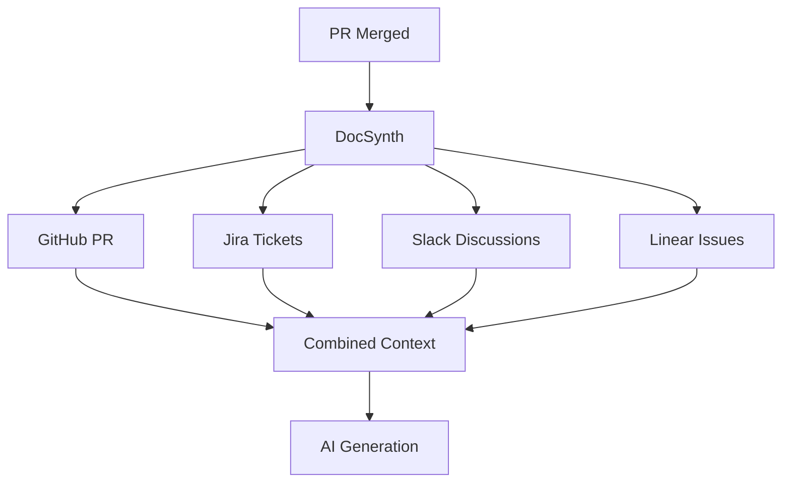

# Core Concepts

DocSynth transforms documentation from a manual task into an automated process. Understanding these core concepts will help you get the most out of it.

## The Documentation Problem

Traditional documentation workflows have fundamental issues:

| Problem | Impact |
|---------|--------|
| Written after the fact | Context is lost, details forgotten |
| Manual maintenance | Docs drift from code over time |
| Inconsistent style | Different authors, different voices |
| No accountability | Nobody owns keeping docs current |

**DocSynth solves this by making documentation an automatic byproduct of development.**

## Key Concepts

### 1. Observation-Based Generation

DocSynth doesn't just analyze your code—it **observes your development process**:

```
Code Changes + PR Context + Tickets + Discussions = Rich Documentation
```

When a PR is merged, DocSynth captures:
- **What changed** — The actual code diff
- **Why it changed** — PR description, comments, linked issues
- **Who changed it** — Author context and history
- **When it changed** — Timing relative to other changes

### 2. Multi-Source Context

DocSynth gathers context from multiple sources via MCP (Model Context Protocol):



This multi-source approach produces documentation that explains **intent**, not just implementation.

### 3. Processing Pipeline

Every change flows through a structured pipeline:

1. **Change Analysis** — Parse diffs, identify semantic changes
2. **Intent Inference** — Gather context from external sources
3. **Doc Generation** — Use LLMs to produce natural language
4. **Review** — Create PR for human review

See [Processing Pipeline](/docs/core-concepts/processing-pipeline) for details.

### 4. Style Learning

DocSynth learns your team's documentation style:

- Analyzes existing documentation
- Identifies patterns in tone, structure, formatting
- Applies learned style to generated content
- Maintains consistency across all docs

See [Style Learning](/docs/core-concepts/style-learning) for details.

### 5. Living Documentation

Documentation is never "done"—it evolves with your code:

- **Automatic updates** — Docs regenerate when relevant code changes
- **Drift detection** — Alerts when docs fall out of sync
- **Self-healing** — Can auto-fix broken links and references
- **Health monitoring** — Dashboard shows documentation freshness

## Architecture Overview

DocSynth consists of several components:

| Component | Purpose |
|-----------|---------|
| **API** | REST API, webhooks, authentication |
| **Worker** | Background job processing |
| **Web** | Dashboard and analytics |
| **CLI** | Local generation and management |
| **VS Code Extension** | IDE integration |

```
┌─────────────┐     ┌─────────────┐     ┌─────────────┐
│   GitHub    │────▶│     API     │────▶│   Worker    │
│  Webhooks   │     │   Server    │     │   Queue     │
└─────────────┘     └─────────────┘     └─────────────┘
                           │                    │
                           ▼                    ▼
                    ┌─────────────┐     ┌─────────────┐
                    │  Dashboard  │     │  LLM APIs   │
                    │    (Web)    │     │ (Generation)│
                    └─────────────┘     └─────────────┘
```

## Workflow Integration

DocSynth integrates into your existing workflow:

```
Developer Flow:
1. Write code
2. Open PR
3. Get review
4. Merge PR
                    ↓
DocSynth Flow:
5. Receive webhook
6. Analyze changes
7. Gather context
8. Generate docs
9. Open docs PR
                    ↓
Team Flow:
10. Review docs PR
11. Merge or request changes
```

No changes to your development process—DocSynth adds documentation automatically.

## Next Steps

- [How It Works](/docs/core-concepts/how-it-works) — Detailed walkthrough
- [Processing Pipeline](/docs/core-concepts/processing-pipeline) — Deep dive into each stage
- [Multi-Source Context](/docs/core-concepts/multi-source-context) — Integrating external sources
- [Style Learning](/docs/core-concepts/style-learning) — How DocSynth matches your voice
