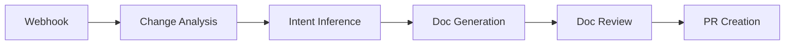
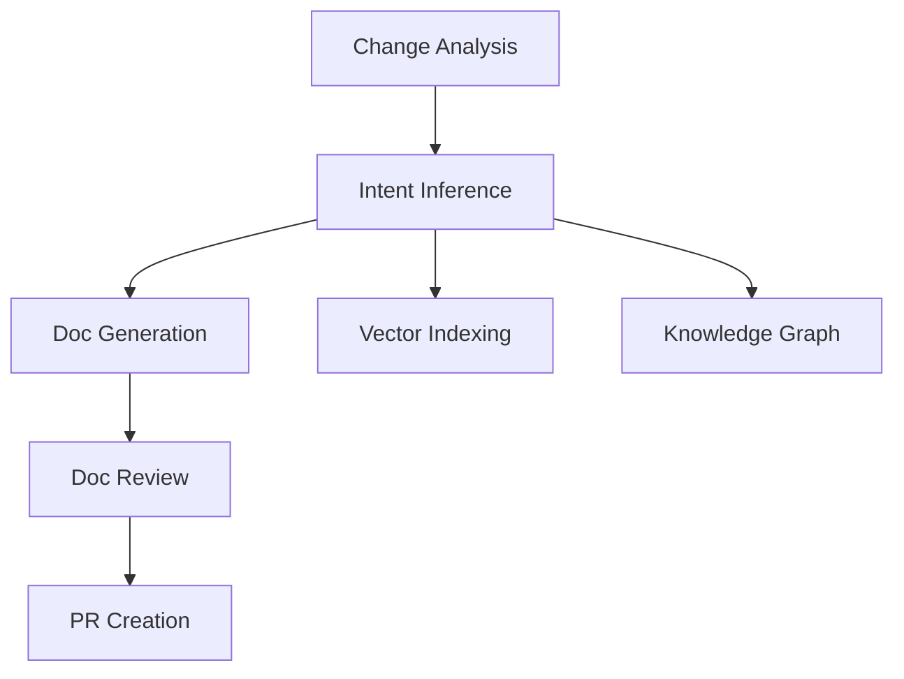

# Processing Pipeline

DocSynth processes changes through a series of specialized workers. Each stage has a specific responsibility and passes data to the next.

## Pipeline Overview



## Stage 1: Change Analysis

**Worker:** `change-analysis`  
**Trigger:** Webhook received  
**Output:** Structured change report

### What It Does

1. **Fetches the diff** from GitHub
2. **Parses changes** into structured data
3. **Identifies semantic changes** (new functions, modified classes, etc.)
4. **Calculates documentation impact**
5. **Determines if docs are needed**

### Change Detection

```typescript
interface ChangeAnalysis {
  files: FileChange[];
  semanticChanges: SemanticChange[];
  impact: 'LOW' | 'MEDIUM' | 'HIGH';
  affectedDocs: string[];
  needsDocumentation: boolean;
}

interface SemanticChange {
  type: 'added' | 'modified' | 'removed';
  kind: 'function' | 'class' | 'interface' | 'type' | 'export';
  name: string;
  file: string;
  signature?: string;
  breaking?: boolean;
}
```

### Impact Scoring

| Impact Level | Criteria |
|-------------|----------|
| **HIGH** | New public APIs, breaking changes, new features |
| **MEDIUM** | Modified APIs, new internal functions, config changes |
| **LOW** | Refactoring, internal changes, dependency updates |

Changes with LOW impact may skip documentation generation (configurable).

## Stage 2: Intent Inference

**Worker:** `intent-inference`  
**Trigger:** Change analysis complete  
**Output:** Enriched context

### What It Does

1. **Fetches PR details** — title, description, comments, reviews
2. **Queries linked issues** — from GitHub, Jira, Linear
3. **Searches discussions** — Slack messages, GitHub discussions
4. **Synthesizes intent** — Why was this change made?

### Context Sources

| Source | Data Gathered |
|--------|--------------|
| **GitHub PR** | Description, comments, review feedback |
| **GitHub Issues** | Linked issues, labels, milestones |
| **Jira** | Ticket description, acceptance criteria, epic context |
| **Linear** | Issue details, project context |
| **Slack** | Related discussions, decisions, questions |
| **Confluence** | Related documentation, architecture docs |

### Output Structure

```typescript
interface InferredIntent {
  summary: string;           // One-line summary
  motivation: string;        // Why this change was made
  technicalContext: string;  // Technical decisions and tradeoffs
  userImpact: string;        // How this affects users
  relatedDocs: string[];     // Existing docs that need updates
  keywords: string[];        // For searchability
}
```

## Stage 3: Doc Generation

**Worker:** `doc-generation`  
**Trigger:** Intent inference complete  
**Output:** Generated documentation

### What It Does

1. **Loads existing documentation** relevant to the changes
2. **Applies style guidelines** learned from your docs
3. **Generates new/updated content** using LLMs
4. **Formats output** according to your preferences

### Generation Strategies

| Strategy | When Used |
|----------|-----------|
| **Create** | New functionality with no existing docs |
| **Update** | Existing docs need modification |
| **Extend** | Add new section to existing doc |
| **Changelog** | Append entry to CHANGELOG.md |

### LLM Configuration

DocSynth supports multiple LLM providers:

```json
{
  "llm": {
    "provider": "anthropic",
    "model": "claude-3-sonnet",
    "temperature": 0.3,
    "maxTokens": 4096
  }
}
```

Lower temperature (0.2-0.4) produces more consistent, factual documentation.

## Stage 4: Doc Review

**Worker:** `doc-review` / `doc-review-copilot`  
**Trigger:** Generation complete  
**Output:** Validated documentation

### What It Does

1. **Validates technical accuracy** — Code examples, API signatures
2. **Checks completeness** — All changes documented
3. **Verifies style consistency** — Matches existing docs
4. **Tests code examples** — Ensures they're runnable

### Validation Checks

| Check | Description |
|-------|-------------|
| **Accuracy** | Generated content matches actual code |
| **Completeness** | All significant changes are documented |
| **Links** | Internal links resolve correctly |
| **Examples** | Code snippets are syntactically valid |
| **Style** | Tone and formatting match guidelines |

### Review Output

```typescript
interface ReviewResult {
  approved: boolean;
  score: number;           // 0-100
  issues: ReviewIssue[];
  suggestions: string[];
}

interface ReviewIssue {
  severity: 'error' | 'warning' | 'info';
  message: string;
  location?: string;
  suggestion?: string;
}
```

## Stage 5: PR Creation

**Worker:** Built into doc-generation  
**Trigger:** Review passes  
**Output:** GitHub Pull Request

### What It Does

1. **Creates a branch** — `docsynth/update-docs-{timestamp}`
2. **Commits changes** — Generated documentation files
3. **Opens PR** — With descriptive title and body
4. **Links context** — References the source PR

### PR Format

```markdown
# docs: Update authentication documentation

This PR was automatically generated by DocSynth.

## Changes
- Updated `docs/api/authentication.md`
- Added examples for token refresh
- Fixed outdated endpoint paths

## Source
Generated from PR #42: "Add JWT authentication"

## Review Notes
- All code examples validated ✓
- Style consistency score: 94/100
- No breaking changes to existing docs

---
🤖 Generated by [DocSynth](https://docsynth.dev)
```

## Parallel Workers

Some workers run in parallel for efficiency:



## Worker Configuration

Configure worker behavior in your `.docsynth.json`:

```json
{
  "pipeline": {
    "skipLowImpact": true,
    "requireReview": true,
    "autoMerge": false,
    "parallelWorkers": ["vector-index", "knowledge-graph"]
  }
}
```

## Monitoring

Track pipeline health in the dashboard:

- **Queue depth** — Jobs waiting to process
- **Processing time** — Duration of each stage
- **Success rate** — Percentage of successful generations
- **Error logs** — Failed jobs with details

## Next Steps

- [Multi-Source Context](/docs/core-concepts/multi-source-context) — Deep dive into context gathering
- [Style Learning](/docs/core-concepts/style-learning) — How DocSynth learns your voice
- [Troubleshooting](/docs/reference/troubleshooting) — Pipeline debugging
