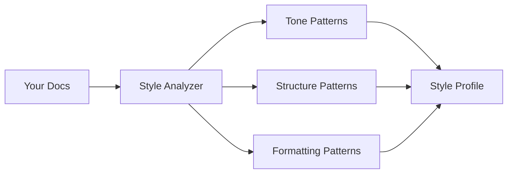

# Style Learning

DocSynth doesn't just generate documentation—it learns your team's voice and applies it consistently.

## The Style Problem

Different documentation styles confuse readers:

```markdown
<!-- Developer A -->
## getUserById
Gets a user by their ID.
Parameters: id (string)
Returns: User object

<!-- Developer B -->
### `getUserById(id: string): Promise<User>`
Retrieves user information from the database based on the provided 
identifier. This method performs a database lookup and returns the 
complete user profile including all associated metadata.

**Parameters:**
| Name | Type | Description |
|------|------|-------------|
| `id` | `string` | The unique user identifier |
```

Both are correct, but inconsistent documentation is harder to navigate.

## How Style Learning Works

### 1. Analyze Existing Documentation

DocSynth analyzes your existing docs to identify patterns:



### 2. Extract Style Characteristics

| Characteristic | What DocSynth Learns |
|----------------|---------------------|
| **Tone** | Formal vs casual, active vs passive voice |
| **Structure** | Section ordering, heading levels |
| **Formatting** | Code block style, table usage, list preferences |
| **Length** | Verbose vs concise explanations |
| **Examples** | Inline vs separate, language preferences |

### 3. Build a Style Profile

DocSynth creates a style profile for your project:

```json
{
  "styleProfile": {
    "tone": {
      "formality": 0.7,
      "voice": "active",
      "person": "second"
    },
    "structure": {
      "headingStyle": "sentence-case",
      "sectionOrder": ["description", "parameters", "returns", "examples"],
      "includeTableOfContents": true
    },
    "formatting": {
      "codeBlockLanguage": "always",
      "usesTables": true,
      "listStyle": "bullet",
      "maxLineLength": 80
    },
    "content": {
      "verbosity": "moderate",
      "includesExamples": true,
      "exampleStyle": "runnable"
    }
  }
}
```

### 4. Apply to Generated Content

New documentation matches your established patterns:

```markdown
## Get User by ID

Retrieves a user from the database by their unique identifier.

### Parameters

| Parameter | Type | Description |
|-----------|------|-------------|
| `id` | `string` | The user's unique identifier |

### Returns

`Promise<User>` — The user object if found, throws `NotFoundError` otherwise.

### Example

```typescript
const user = await getUserById('usr_abc123');
console.log(user.email); // user@example.com
```
```

## Style Dimensions

### Tone

DocSynth detects your documentation tone:

| Tone | Example |
|------|---------|
| **Technical** | "The function accepts a string parameter and returns a Promise" |
| **Casual** | "Pass in a string and you'll get back a Promise" |
| **Formal** | "This method shall accept a string parameter and return a Promise" |

Configure in `.docsynth.json`:

```json
{
  "style": {
    "tone": "technical"
  }
}
```

### Voice

Active vs passive voice detection:

| Voice | Example |
|-------|---------|
| **Active** | "The function validates the input" |
| **Passive** | "The input is validated by the function" |

### Person

First, second, or third person:

| Person | Example |
|--------|---------|
| **First** | "We recommend using async/await" |
| **Second** | "You should use async/await" |
| **Third** | "Users should use async/await" |

## Structure Learning

DocSynth learns your documentation structure:

### Section Ordering

If your existing docs follow this pattern:

```markdown
## Function Name
Description of what it does.

### Syntax
```code```

### Parameters
...

### Return Value
...

### Exceptions
...

### Examples
...
```

DocSynth will follow the same order in generated content.

### Heading Levels

DocSynth matches your heading hierarchy:

```markdown
# API Reference        ← Level 1 for categories
## Authentication      ← Level 2 for features
### Login             ← Level 3 for methods
#### Parameters       ← Level 4 for details
```

## Formatting Patterns

### Code Blocks

DocSynth detects your code block preferences:

```json
{
  "formatting": {
    "codeBlocks": {
      "alwaysSpecifyLanguage": true,
      "preferredLanguage": "typescript",
      "showLineNumbers": false
    }
  }
}
```

### Tables vs Lists

If your docs prefer tables for parameters:

```markdown
| Parameter | Type | Required | Description |
|-----------|------|----------|-------------|
| `id` | `string` | Yes | User ID |
| `options` | `object` | No | Query options |
```

DocSynth will generate tables instead of lists.

### Admonitions

DocSynth learns your warning/note style:

```markdown
:::warning
This operation cannot be undone.
:::

<!-- or -->

> ⚠️ **Warning:** This operation cannot be undone.

<!-- or -->

**Note:** This operation cannot be undone.
```

## Training the Style Model

### Automatic Learning

DocSynth automatically learns from:

- README files
- API documentation
- Guides and tutorials
- Code comments (JSDoc, etc.)

### Explicit Style Guide

Provide explicit rules in `.docsynth.json`:

```json
{
  "style": {
    "tone": "technical",
    "voice": "active",
    "person": "second",
    "guidelines": [
      "Always include runnable examples",
      "Use tables for function parameters",
      "Keep descriptions under 2 sentences",
      "Prefer 'returns' over 'return value'",
      "Include TypeScript types in code examples"
    ]
  }
}
```

### Style Examples

Provide example documentation for DocSynth to learn from:

```json
{
  "style": {
    "exampleDocs": [
      "docs/api/users.md",
      "docs/guides/authentication.md"
    ]
  }
}
```

## Style Consistency Score

DocSynth calculates a consistency score for generated docs:

```
Style Consistency Report
========================

Overall Score: 94/100

✓ Tone matches (technical)
✓ Structure follows existing patterns
✓ Code blocks properly formatted
⚠ Heading level inconsistency (line 45)
✓ Examples included where expected
```

## Overriding Learned Style

Sometimes you need to override the learned style:

### Per-File Override

```markdown
---
docsynth:
  tone: casual
  includeExamples: false
---

# Quick Start
```

### Per-Section Override

```markdown
<!-- docsynth: verbose -->
## Detailed Explanation

This section should be more verbose than the default...
<!-- /docsynth -->
```

## Best Practices

### 1. Start with Good Examples

The better your existing docs, the better DocSynth's output:

- Document a few features thoroughly
- Be consistent in those examples
- DocSynth will follow your lead

### 2. Provide Explicit Guidelines

When style matters, be explicit:

```json
{
  "style": {
    "guidelines": [
      "Use American English spelling",
      "Capitalize product names: DocSynth, GitHub, Slack",
      "Use 'they' as singular pronoun",
      "Abbreviations: API, URL, JSON (no periods)"
    ]
  }
}
```

### 3. Review and Iterate

- Review generated documentation
- Correct style issues in reviews
- DocSynth learns from merged corrections

## Next Steps

- [Configuration](/docs/guides/configuring-docsynth) — All style configuration options
- [API Reference](/docs/api-reference/configuration-schema) — Complete schema
- [Troubleshooting](/docs/reference/troubleshooting) — Style-related issues
