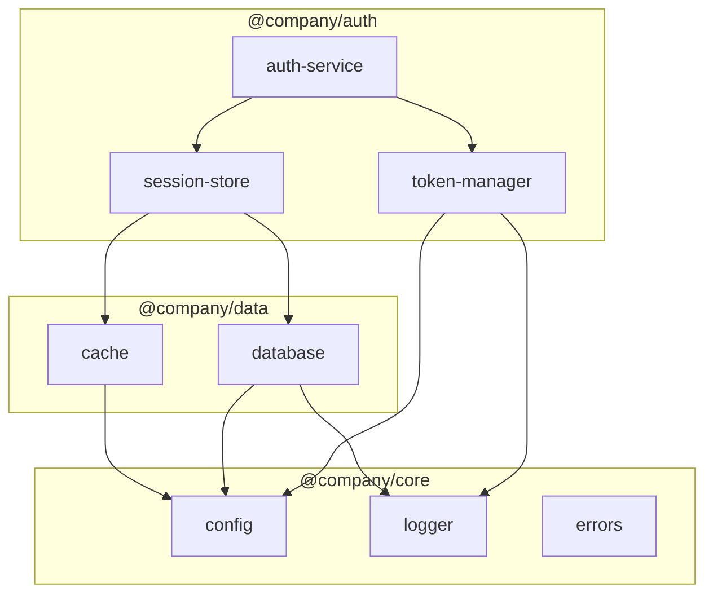

# Real-World Examples

See how teams use DocSynth to automate their documentation workflows.

## E-Commerce Platform

A large e-commerce company with 50+ microservices uses DocSynth to keep API documentation current across teams.

### Challenge

- 12 engineering teams working on different services
- API contracts changed frequently
- Documentation was always 2-3 sprints behind
- Integration teams struggled with outdated docs

### Solution

```json
{
  "version": 1,
  "triggers": {
    "onPRMerge": true,
    "branches": ["main", "release/*"]
  },
  "filters": {
    "includePaths": ["src/api/**", "src/controllers/**"],
    "excludePaths": ["**/*.test.ts"]
  },
  "docTypes": {
    "apiDocs": true,
    "changelog": true
  },
  "advanced": {
    "diagrams": {
      "enabled": true,
      "types": ["sequence"]
    }
  }
}
```

### Results

- **90% reduction** in documentation lag time
- API docs update within 24 hours of code merge
- Integration team onboarding time cut by 40%
- Sequence diagrams auto-generated for all API flows

### Example Output

When a developer added a new payment endpoint, DocSynth automatically generated:

**API Reference:**
```markdown
## POST /api/v2/payments/refund

Initiates a refund for a completed payment.

### Request Body

| Field | Type | Required | Description |
|-------|------|----------|-------------|
| `paymentId` | string | Yes | Original payment ID |
| `amount` | number | No | Partial refund amount (defaults to full) |
| `reason` | string | No | Refund reason for records |

### Example

```bash
curl -X POST https://api.example.com/api/v2/payments/refund \
  -H "Authorization: Bearer $TOKEN" \
  -H "Content-Type: application/json" \
  -d '{
    "paymentId": "pay_abc123",
    "amount": 50.00,
    "reason": "Customer request"
  }'
```

### Response

```json
{
  "refundId": "ref_xyz789",
  "status": "pending",
  "amount": 50.00,
  "estimatedCompletion": "2026-02-05T10:00:00Z"
}
```
```

---

## SaaS Startup

A B2B SaaS startup with a public API uses DocSynth to maintain developer-facing documentation.

### Challenge

- Small team (8 engineers) moving fast
- Public API documentation critical for customers
- No dedicated technical writer
- Frequent breaking changes needed clear communication

### Solution

```json
{
  "version": 1,
  "triggers": {
    "onPRMerge": true,
    "branches": ["main"]
  },
  "docTypes": {
    "readme": true,
    "apiDocs": true,
    "changelog": true
  },
  "style": {
    "tone": "friendly",
    "includeExamples": true,
    "targetAudience": "developers"
  },
  "advanced": {
    "driftDetection": {
      "enabled": true,
      "thresholdDays": 7,
      "alertOnDrift": true
    },
    "translations": {
      "enabled": true,
      "targetLanguages": ["es", "ja"]
    }
  }
}
```

### Results

- Public API docs always match current behavior
- Changelog automatically generated for each release
- Spanish and Japanese docs for international customers
- Drift alerts catch documentation gaps before customers report them

### Example: Breaking Change Documentation

When the team changed an endpoint response format, DocSynth automatically:

1. **Updated the API reference** with new response structure
2. **Generated a changelog entry:**

```markdown
## [2.4.0] - 2026-01-28

### ⚠️ Breaking Changes

#### `GET /users/:id` Response Format Changed

The `address` field is now an object instead of a string.

**Before:**
```json
{
  "id": "user_123",
  "name": "Jane Doe",
  "address": "123 Main St, City, ST 12345"
}
```

**After:**
```json
{
  "id": "user_123",
  "name": "Jane Doe",
  "address": {
    "street": "123 Main St",
    "city": "City",
    "state": "ST",
    "zip": "12345"
  }
}
```

**Migration:** Update any code that reads `user.address` as a string to access `user.address.street`, etc.
```

3. **Flagged the change for review** in the PR

---

## Open Source Library

A popular open-source TypeScript library uses DocSynth to generate API reference from JSDoc comments.

### Challenge

- Complex API with 100+ exported functions
- Maintaining API reference manually was error-prone
- Examples in docs didn't match actual behavior
- Contributors documented inconsistently

### Solution

```json
{
  "version": 1,
  "triggers": {
    "onPRMerge": true,
    "branches": ["main"]
  },
  "filters": {
    "includePaths": ["src/**/*.ts"],
    "excludePaths": ["src/**/*.test.ts", "src/internal/**"]
  },
  "docTypes": {
    "apiDocs": true
  },
  "style": {
    "tone": "technical",
    "includeExamples": true,
    "extractFromJSDoc": true
  },
  "advanced": {
    "diagrams": {
      "enabled": true,
      "types": ["class"]
    },
    "knowledgeGraph": {
      "enabled": true
    }
  }
}
```

### Example: Generated from JSDoc

**Source code:**
```typescript
/**
 * Creates a new query builder for the specified table.
 * 
 * @param table - The table name to query
 * @param options - Optional configuration
 * @returns A QueryBuilder instance
 * 
 * @example
 * ```typescript
 * const query = createQuery('users', { timeout: 5000 });
 * const users = await query.where('active', true).limit(10).execute();
 * ```
 * 
 * @since 2.0.0
 * @see QueryBuilder
 */
export function createQuery<T>(
  table: string,
  options?: QueryOptions
): QueryBuilder<T> {
  // implementation
}
```

**Generated documentation:**
```markdown
## createQuery

Creates a new query builder for the specified table.

### Signature

```typescript
function createQuery<T>(table: string, options?: QueryOptions): QueryBuilder<T>
```

### Parameters

| Parameter | Type | Description |
|-----------|------|-------------|
| `table` | `string` | The table name to query |
| `options` | `QueryOptions` | Optional configuration |

### Returns

`QueryBuilder<T>` - A QueryBuilder instance

### Example

```typescript
const query = createQuery('users', { timeout: 5000 });
const users = await query.where('active', true).limit(10).execute();
```

### Since

2.0.0

### See Also

- QueryBuilder
```

---

## Enterprise Monorepo

A Fortune 500 company with a large monorepo uses DocSynth for internal documentation.

### Challenge

- 200+ internal packages in monorepo
- Developers couldn't find relevant documentation
- Tribal knowledge lost when engineers left
- Compliance requirements for documentation

### Solution

```json
{
  "version": 1,
  "triggers": {
    "onPRMerge": true,
    "branches": ["main"]
  },
  "filters": {
    "includePaths": ["packages/*/src/**"],
    "excludePaths": ["**/test/**", "**/internal/**"]
  },
  "docTypes": {
    "readme": true,
    "apiDocs": true
  },
  "advanced": {
    "knowledgeGraph": {
      "enabled": true,
      "includeTypes": ["class", "interface", "function", "module"]
    },
    "diagrams": {
      "enabled": true,
      "types": ["architecture", "dependency"]
    },
    "driftDetection": {
      "enabled": true,
      "thresholdDays": 30,
      "alertOnDrift": true
    }
  },
  "integrations": {
    "slack": {
      "channel": "#platform-docs",
      "notifyOnGeneration": true,
      "notifyOnDrift": true
    }
  }
}
```

### Results

- Knowledge graph connects 2,000+ entities across packages
- Onboarding time for new engineers reduced by 60%
- Compliance audits pass with auto-generated documentation trail
- Slack notifications keep teams aware of documentation changes

### Example: Dependency Diagram

DocSynth automatically generates dependency diagrams for each package:



---

## Developer Portal

A fintech company uses DocSynth to power their public developer portal.

### Challenge

- Multiple products with separate APIs
- Need for interactive API explorer
- Strict accuracy requirements (financial data)
- Multiple language SDKs to document

### Solution

```json
{
  "version": 1,
  "triggers": {
    "onPRMerge": true,
    "branches": ["main"]
  },
  "docTypes": {
    "apiDocs": true,
    "sdkDocs": true
  },
  "style": {
    "tone": "professional",
    "includeExamples": true
  },
  "advanced": {
    "translations": {
      "enabled": true,
      "targetLanguages": ["es", "pt-BR", "ja", "zh"]
    },
    "driftDetection": {
      "enabled": true,
      "thresholdDays": 3
    }
  },
  "publishing": {
    "portal": {
      "enabled": true,
      "domain": "developers.fintech.com"
    }
  }
}
```

### SDK Documentation Example

DocSynth generates consistent examples across all SDKs:

**Node.js:**
```typescript
import { FinTech } from '@fintech/sdk';

const client = new FinTech({ apiKey: 'your_key' });

const account = await client.accounts.get('acc_123');
console.log(account.balance);
```

**Python:**
```python
from fintech import FinTech

client = FinTech(api_key='your_key')

account = client.accounts.get('acc_123')
print(account.balance)
```

**Go:**
```go
client := fintech.NewClient("your_key")

account, err := client.Accounts.Get(ctx, "acc_123")
if err != nil {
    log.Fatal(err)
}
fmt.Println(account.Balance)
```

---

## Quick Start Templates

Copy these configurations to get started quickly:

### Minimal Configuration

```json
{
  "version": 1,
  "triggers": { "onPRMerge": true },
  "docTypes": { "readme": true }
}
```

### API-Focused

```json
{
  "version": 1,
  "triggers": { "onPRMerge": true },
  "docTypes": { "apiDocs": true, "changelog": true },
  "advanced": { "driftDetection": { "enabled": true } }
}
```

### Full-Featured

```json
{
  "version": 1,
  "triggers": { "onPRMerge": true },
  "docTypes": { "readme": true, "apiDocs": true, "changelog": true },
  "advanced": {
    "knowledgeGraph": { "enabled": true },
    "diagrams": { "enabled": true, "types": ["architecture", "sequence"] },
    "driftDetection": { "enabled": true },
    "translations": { "enabled": true, "targetLanguages": ["es", "ja"] }
  }
}
```

---

## Share Your Story

Using DocSynth in an interesting way? We'd love to feature your use case!

- Email: stories@docsynth.dev
- Twitter: [@docsynthdev](https://twitter.com/docsynthdev)
- Discord: [#showcase](https://discord.gg/docsynth)
