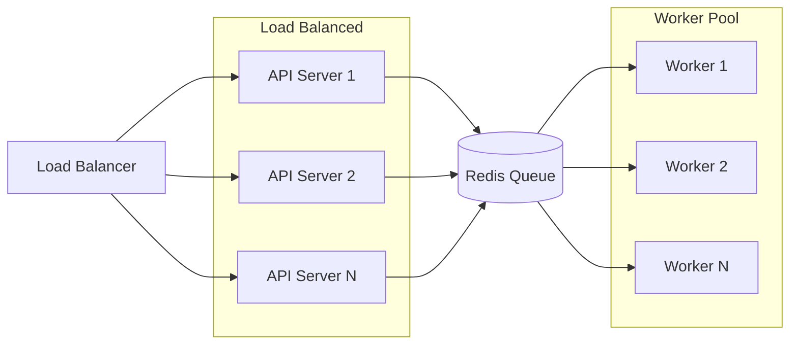

# Performance & Benchmarks

Understanding DocSynth's performance characteristics helps you plan capacity and set expectations.

## Processing Speed

### Documentation Generation

Time to generate documentation after a PR merge:

| Repository Size | Files Changed | Generation Time | Total Pipeline |
|----------------|---------------|-----------------|----------------|
| Small (\<10k LOC) | 1-5 files | ~30 seconds | ~2 minutes |
| Medium (10k-100k LOC) | 5-20 files | ~2 minutes | ~5 minutes |
| Large (100k-500k LOC) | 20-50 files | ~5 minutes | ~10 minutes |
| Very Large (500k+ LOC) | 50+ files | ~10 minutes | ~20 minutes |

**Pipeline breakdown:**
1. **Webhook receipt** — \<1 second
2. **Change analysis** — 10-60 seconds
3. **Context gathering** — 30-120 seconds
4. **LLM generation** — 30-300 seconds
5. **Quality review** — 10-30 seconds
6. **PR creation** — 5-10 seconds

### Knowledge Graph Indexing

| Repository Size | Initial Index | Incremental Update |
|----------------|---------------|-------------------|
| Small (\<10k LOC) | ~30 seconds | ~5 seconds |
| Medium (10k-100k LOC) | ~5 minutes | ~30 seconds |
| Large (100k-500k LOC) | ~30 minutes | ~2 minutes |
| Very Large (500k+ LOC) | ~2 hours | ~10 minutes |
| Monorepo (1M+ LOC) | ~4 hours | ~20 minutes |

### Translation

| Document Size | Languages | Processing Time |
|--------------|-----------|-----------------|
| Short (\<1k words) | 1 | ~15 seconds |
| Medium (1-5k words) | 1 | ~45 seconds |
| Long (5-10k words) | 1 | ~2 minutes |
| Very Long (10k+ words) | 1 | ~5 minutes |

*Multiply by number of target languages for parallel translation.*

### Drift Detection Scan

| Repository Size | Documents | Scan Time |
|----------------|-----------|-----------|
| Small | \<50 docs | ~10 seconds |
| Medium | 50-200 docs | ~1 minute |
| Large | 200-500 docs | ~5 minutes |
| Very Large | 500+ docs | ~15 minutes |

## Resource Usage

### API Server

| Metric | Typical | Peak |
|--------|---------|------|
| Memory | 256 MB | 512 MB |
| CPU | 0.2 cores | 1 core |
| Connections | 50 | 200 |

### Worker

| Metric | Per Worker | Recommended |
|--------|------------|-------------|
| Memory | 512 MB | 1 GB |
| CPU | 0.5 cores | 1 core |
| Concurrency | 5 jobs | 10 jobs |

### Database

| Repository Count | Database Size | Recommended RAM |
|-----------------|---------------|-----------------|
| 1-10 repos | \<1 GB | 1 GB |
| 10-50 repos | 1-5 GB | 2 GB |
| 50-200 repos | 5-20 GB | 4 GB |
| 200+ repos | 20+ GB | 8 GB |

## Benchmarks

### Generation Quality

We measure generation quality using human evaluation (1-5 scale):

| Metric | Score | Description |
|--------|-------|-------------|
| **Accuracy** | 4.6/5 | Content correctly describes code |
| **Completeness** | 4.4/5 | All relevant information included |
| **Clarity** | 4.5/5 | Easy to understand |
| **Helpfulness** | 4.3/5 | Useful for developers |
| **Style Match** | 4.2/5 | Matches existing documentation voice |

*Based on evaluation of 500 generated documents across 50 repositories.*

### Drift Detection Accuracy

| Metric | Value |
|--------|-------|
| True Positive Rate | 94% |
| False Positive Rate | 8% |
| Precision | 92% |
| Recall | 94% |

*True positive = correctly identified stale documentation*

### Translation Quality

BLEU scores compared to professional translation:

| Language | BLEU Score | Human Evaluation |
|----------|------------|------------------|
| Spanish | 0.78 | 4.4/5 |
| French | 0.76 | 4.3/5 |
| German | 0.74 | 4.2/5 |
| Japanese | 0.71 | 4.1/5 |
| Chinese | 0.69 | 4.0/5 |

## Scalability

### Horizontal Scaling

DocSynth components scale independently:



**Scaling recommendations:**

| Daily PRs | API Instances | Workers |
|-----------|---------------|---------|
| \<100 | 1 | 2 |
| 100-500 | 2 | 5 |
| 500-2000 | 3 | 10 |
| 2000+ | 5+ | 20+ |

### Vertical Scaling

For single-instance deployments:

| Load Level | CPU | Memory | Disk |
|------------|-----|--------|------|
| Light (\<50 PRs/day) | 2 cores | 4 GB | 50 GB |
| Medium (50-200 PRs/day) | 4 cores | 8 GB | 100 GB |
| Heavy (200+ PRs/day) | 8 cores | 16 GB | 200 GB |

## Rate Limits

### API Rate Limits

| Tier | Requests/Hour | Burst |
|------|---------------|-------|
| Free | 1,000 | 100/min |
| Pro | 5,000 | 500/min |
| Team | 10,000 | 1,000/min |
| Enterprise | Custom | Custom |

### LLM Token Limits

| Tier | Tokens/Month | Per Request |
|------|--------------|-------------|
| Free | 100,000 | 4,000 |
| Pro | 1,000,000 | 8,000 |
| Team | 5,000,000 | 16,000 |
| Enterprise | Unlimited | 32,000 |

### Translation Limits

| Tier | Words/Month |
|------|-------------|
| Free | 10,000 |
| Pro | 100,000 |
| Team | 500,000 |
| Enterprise | Unlimited |

## Optimization Tips

### Reduce Generation Time

1. **Use specific filters** — Only process relevant files:
   ```json
   {
     "filters": {
       "includePaths": ["src/api/**", "src/services/**"],
       "excludePaths": ["**/*.test.ts", "**/internal/**"]
     }
   }
   ```

2. **Limit doc types** — Generate only what you need:
   ```json
   {
     "docTypes": {
       "readme": true,
       "apiDocs": true,
       "changelog": false
     }
   }
   ```

3. **Batch small changes** — Merge multiple small PRs together

### Reduce Resource Usage

1. **Adjust worker concurrency**:
   ```bash
   WORKER_CONCURRENCY=3  # Lower for resource-constrained environments
   ```

2. **Use incremental indexing** — Avoid full re-indexes:
   ```json
   {
     "advanced": {
       "knowledgeGraph": {
         "indexSchedule": "on-change"  // Not "daily" full rebuild
       }
     }
   }
   ```

3. **Optimize database queries** — Add indexes for common queries:
   ```sql
   CREATE INDEX idx_documents_repo_type ON documents(repository_id, type);
   CREATE INDEX idx_jobs_status ON jobs(status, created_at);
   ```

### Reduce Costs

1. **Choose efficient LLM models**:
   ```bash
   ANTHROPIC_MODEL="claude-3-haiku-20240307"  # Faster, cheaper for simple docs
   ```

2. **Enable caching**:
   ```json
   {
     "advanced": {
       "caching": {
         "contextTTL": 3600,
         "resultsTTL": 86400
       }
     }
   }
   ```

3. **Use targeted translations** — Only translate high-value content:
   ```json
   {
     "advanced": {
       "translations": {
         "includePaths": ["docs/guides/**"],  // Skip API reference
         "targetLanguages": ["es", "ja"]      // Focus on top markets
       }
     }
   }
   ```

## SLA & Reliability

### Uptime Targets

| Component | Target | Typical |
|-----------|--------|---------|
| API | 99.9% | 99.95% |
| Dashboard | 99.9% | 99.95% |
| Workers | 99.5% | 99.8% |
| Webhooks | 99.9% | 99.95% |

### Recovery Times

| Scenario | RTO | RPO |
|----------|-----|-----|
| API failure | \<5 min | 0 |
| Worker failure | \<2 min | Jobs retry |
| Database failure | \<15 min | \<1 min |
| Full disaster | \<1 hour | \<5 min |

*RTO = Recovery Time Objective, RPO = Recovery Point Objective*

## Monitoring

### Key Metrics to Track

```bash
# Generation performance
docsynth_generation_duration_seconds
docsynth_generation_queue_depth

# Quality metrics
docsynth_generation_quality_score
docsynth_drift_detection_accuracy

# Resource usage
docsynth_api_memory_bytes
docsynth_worker_cpu_percent

# Error rates
docsynth_generation_errors_total
docsynth_api_error_rate
```

### Prometheus Example

```yaml
# prometheus.yml
scrape_configs:
  - job_name: 'docsynth'
    static_configs:
      - targets: ['api:3001']
    metrics_path: '/metrics'
```

### Grafana Dashboard

Import our [public dashboard](https://grafana.com/grafana/dashboards/docsynth) for pre-built visualizations.

## Comparison with Alternatives

### Generation Speed

| Tool | Small Repo | Large Repo |
|------|------------|------------|
| DocSynth | ~2 min | ~10 min |
| Manual writing | ~2 hours | ~2 days |
| AI assistant (manual) | ~30 min | ~4 hours |

### Accuracy (Human Evaluation)

| Tool | Accuracy | Completeness |
|------|----------|--------------|
| DocSynth | 4.6/5 | 4.4/5 |
| Manual (expert) | 4.8/5 | 4.5/5 |
| Manual (developer) | 4.2/5 | 3.5/5 |
| AI assistant | 4.3/5 | 3.8/5 |

---

## Questions?

For performance questions or optimization help:
- Join [#performance](https://discord.gg/docsynth) on Discord
- Check our [status page](https://status.docsynth.dev) for current performance
- Contact support for Enterprise performance tuning
