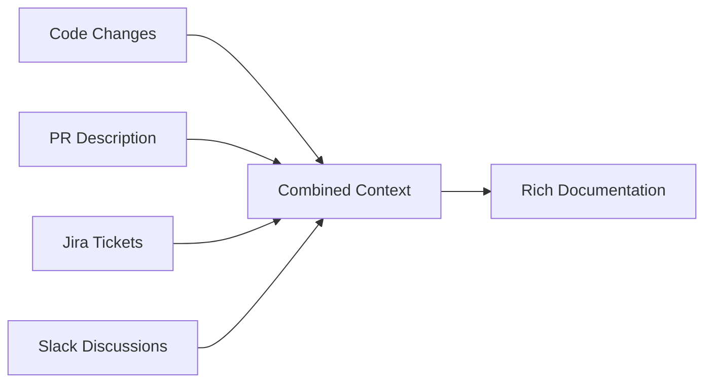

# DocSynth vs Alternatives

An honest comparison of DocSynth with other documentation approaches to help you make the right choice.

## Quick Comparison

| Feature | DocSynth | JSDoc/TSDoc | Mintlify | ReadMe | GitBook | Manual |
|---------|:--------:|:-----------:|:--------:|:------:|:-------:|:------:|
| Auto-generates from code | ✅ | ⚠️ | ❌ | ❌ | ❌ | ❌ |
| Updates on code changes | ✅ | ❌ | ❌ | ❌ | ❌ | ❌ |
| Multi-source context | ✅ | ❌ | ❌ | ❌ | ❌ | ❌ |
| Style learning | ✅ | ❌ | ❌ | ❌ | ❌ | ❌ |
| Drift detection | ✅ | ❌ | ❌ | ⚠️ | ❌ | ❌ |
| Human-quality prose | ✅ | ❌ | ✅ | ✅ | ✅ | ✅ |
| Beautiful hosting | ❌ | ❌ | ✅ | ✅ | ✅ | ⚠️ |
| Interactive API explorer | ❌ | ❌ | ✅ | ✅ | ⚠️ | ❌ |
| No workflow change | ✅ | ⚠️ | ⚠️ | ⚠️ | ⚠️ | ✅ |
| Free tier | ✅ | ✅ | ✅ | ✅ | ✅ | ✅ |

**Legend:** ✅ Full support | ⚠️ Partial/limited | ❌ Not supported

## Detailed Comparisons

### DocSynth vs JSDoc/TSDoc

**JSDoc/TSDoc** extracts documentation from structured code comments.

| Aspect | DocSynth | JSDoc/TSDoc |
|--------|----------|-------------|
| **Input** | Code + PRs + tickets + chat | Comments in code |
| **Output** | Natural language docs | Structured API reference |
| **Maintenance** | Automatic | Manual comment updates |
| **Context** | "Why" + "What" | "What" only |
| **Setup time** | 5 minutes | None (built-in) |
| **Accuracy** | AI-verified | Always accurate (from code) |

**Example comparison:**

*JSDoc output:*
```typescript
/**
 * @param userId - The user ID
 * @returns The user object
 */
function getUser(userId: string): User
```

*DocSynth output:*
```markdown
## getUser(userId)

Retrieves a user by their unique identifier. This function is typically called 
after authentication to load the current user's profile.

**Parameters:**
- `userId` (string): The unique identifier assigned during registration

**Returns:** A `User` object containing profile information, preferences, and 
account status. Returns `null` if the user doesn't exist or has been deactivated.

**Example:**
```typescript
const user = await getUser('usr_abc123');
if (user) {
  console.log(`Welcome back, ${user.name}!`);
}
```
```

**Best practice:** Use both. JSDoc for IDE support and type docs, DocSynth for comprehensive documentation.

---

### DocSynth vs Mintlify

**Mintlify** is a modern documentation platform with beautiful themes.

| Aspect | DocSynth | Mintlify |
|--------|----------|----------|
| **Primary focus** | Content generation | Hosting & design |
| **Content creation** | Automatic from code | Manual + AI assist |
| **GitHub integration** | Native (webhooks, PRs) | Git sync |
| **Update frequency** | On every PR merge | When you push |
| **Learning curve** | Low | Medium |
| **Pricing** | From free | From $150/mo |

**When to choose Mintlify:**
- Beautiful documentation is a priority
- Marketing-focused documentation
- You have technical writers creating content
- You want pre-built components and themes

**When to choose DocSynth:**
- Keeping docs in sync is the pain point
- Developer-first workflow
- You want "set it and forget it"
- Limited resources for documentation

**Best practice:** Generate with DocSynth, export to Mintlify for hosting. (Integration coming soon)

---

### DocSynth vs ReadMe

**ReadMe** is an established API documentation platform with interactive features.

| Aspect | DocSynth | ReadMe |
|--------|----------|--------|
| **Primary focus** | Auto-generation | API portal |
| **Content source** | Code analysis | OpenAPI/manual |
| **API testing** | Code examples | Interactive explorer |
| **Updates** | Automatic on merge | Sync from OpenAPI |
| **Analytics** | Basic | Detailed |
| **Pricing** | From free | From $99/mo |

**When to choose ReadMe:**
- Public API documentation
- Need interactive "Try it" functionality
- Want detailed usage analytics
- Enterprise developer portal

**When to choose DocSynth:**
- Beyond just API reference
- Internal documentation
- Want automatic updates from code
- Tighter GitHub integration

**Best practice:** Use ReadMe for public API portal, DocSynth for internal docs and keeping everything current.

---

### DocSynth vs GitBook

**GitBook** is a documentation platform with a powerful editor.

| Aspect | DocSynth | GitBook |
|--------|----------|---------|
| **Content creation** | Automatic | Manual/WYSIWYG |
| **Version control** | Git-native | Git sync |
| **Collaboration** | Via PRs | Real-time editing |
| **Customization** | Limited | Extensive |
| **Pricing** | From free | From free |

**When to choose GitBook:**
- Non-technical contributors
- Real-time collaboration needed
- Extensive customization required
- Knowledge base use case

**When to choose DocSynth:**
- Developer-focused documentation
- Code-driven content
- Automatic maintenance
- GitHub-centric workflow

---

### DocSynth vs AI Writing Assistants

**AI assistants** (Claude, ChatGPT, Copilot) help write documentation on demand.

| Aspect | DocSynth | AI Assistants |
|--------|----------|---------------|
| **Automation** | Fully automatic | Manual prompting |
| **Context** | Full codebase + history | What you provide |
| **Integration** | GitHub-native | Copy/paste or IDE |
| **Maintenance** | Continuous | One-time |
| **Consistency** | Learned style | Varies |
| **Cost** | Subscription | Per-use |

**When to choose AI assistants:**
- One-off documentation tasks
- Brainstorming and drafting
- Explaining complex code snippets
- Ad-hoc content creation

**When to choose DocSynth:**
- Ongoing documentation maintenance
- Consistent updates across codebase
- Team-wide documentation workflow
- Automation is priority

---

### DocSynth vs Manual Documentation

The classic approach: developers write and maintain docs themselves.

| Aspect | DocSynth | Manual |
|--------|----------|--------|
| **Time investment** | 5 min setup | Ongoing |
| **Freshness** | Always current | Often outdated |
| **Coverage** | Comprehensive | Varies by priority |
| **Quality** | Consistent | Depends on author |
| **Cost** | $0-199/mo | Developer hours |
| **Control** | AI + review | Full control |

**When manual works:**
- Small, stable projects
- Highly specialized content
- Strong documentation culture
- Dedicated technical writers

**When DocSynth excels:**
- Active development
- Growing codebase
- Limited documentation resources
- Consistency is important

---

## Unique DocSynth Features

### Multi-Source Context

Only DocSynth combines multiple context sources:



This produces documentation that explains **why** changes were made, not just **what** changed.

**Example:** A code change that adds pagination might be documented as:
> "Added pagination to the `/users` endpoint to handle large customer datasets. This change was requested in PROJ-1234 to address performance issues reported by the Enterprise team."

### Style Learning

DocSynth analyzes your existing documentation to learn:
- Tone (technical, friendly, formal)
- Structure preferences
- Common terminology
- Example patterns
- Formatting conventions

**Result:** Generated docs feel like they were written by your team.

### Drift Detection Algorithm

DocSynth's drift detection uses multiple signals:

1. **Temporal drift** — Time since last doc update vs. code change
2. **Semantic drift** — AI analysis of whether changes are significant
3. **Link validation** — Checking references still resolve
4. **Freshness scoring** — Combined metric (0-100)

No other tool offers this level of drift analysis.

---

## Feature Matrix by Use Case

### For API Documentation

| Tool | Generation | Interactive Testing | Analytics | Auto-Update |
|------|------------|---------------------|-----------|-------------|
| DocSynth | ✅ | ❌ | Basic | ✅ |
| ReadMe | Manual | ✅ | ✅ | From OpenAPI |
| Mintlify | AI-assist | ✅ | ✅ | ❌ |

**Recommendation:** DocSynth + ReadMe for comprehensive API docs

### For Internal Documentation

| Tool | Generation | Collaboration | Search | Maintenance |
|------|------------|---------------|--------|-------------|
| DocSynth | ✅ | Via PRs | ✅ | Automatic |
| GitBook | Manual | ✅ | ✅ | Manual |
| Notion | Manual | ✅ | ✅ | Manual |

**Recommendation:** DocSynth for technical docs, Notion for team wiki

### For Open Source Projects

| Tool | Generation | Hosting | Community | Cost |
|------|------------|---------|-----------|------|
| DocSynth | ✅ | BYO | Via GitHub | Free tier |
| Docusaurus | Manual | GitHub Pages | ✅ | Free |
| ReadTheDocs | Manual | ✅ | ✅ | Free |

**Recommendation:** DocSynth + Docusaurus (like this site!)

---

## Making Your Choice

### Choose DocSynth if you:

✅ Want documentation to stay current automatically  
✅ Have active development with frequent PRs  
✅ Use GitHub for version control  
✅ Want context-rich documentation  
✅ Have limited documentation resources  
✅ Value consistency across docs  

### Consider alternatives if you:

❌ Need a beautiful documentation hosting platform → Add Mintlify/ReadMe  
❌ Only need API reference from code comments → Use JSDoc/TSDoc  
❌ Have a small, stable codebase with no changes → Manual is fine  
❌ Need real-time collaboration for non-developers → Try GitBook/Notion  
❌ Want interactive API testing → Add ReadMe  

### The Hybrid Approach

Many teams use DocSynth alongside other tools:

```
DocSynth (generation) → Mintlify/ReadMe (hosting) → Analytics
                     ↘ GitHub (source control)
```

DocSynth focuses on **keeping content current**. Pair it with the best hosting solution for your needs.

---

## Try DocSynth

The best way to compare is to try it yourself:

```bash
npm install -g @docsynth/cli
docsynth login
docsynth init
```

Generate your first documentation in under 5 minutes. See how it compares to your current workflow.

→ [Get Started](/docs/getting-started)
